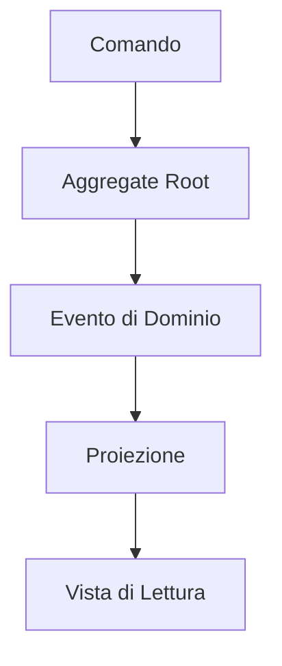

# Sourcing di Eventi in Laravel

**Una strategia oltre il CRUD**

Di Brent Roose

**EVENT-SOURCING-LARAVEL.COM | SPATIE**

---

## Introduzione al Sourcing di Eventi in Laravel

**Un corso pratico per iniziare a utilizzare il sourcing di eventi in applicazioni di grandi dimensioni.**

Questo libro, pubblicato nel 2021 da Spatie, rappresenta una distillazione delle lezioni apprese dal team Spatie negli ultimi due anni. È stato rivisto da esperti come Freek Van der Herten e Matthias Noback, con design e composizione a cura di Sebastian De Deyne e Willem Van Bockstal.

> **Nota**: Per segnalare errori, contattare info@spatie.be.

---

## Indice dei Contenuti

- **Prefazione**
- **Introduzione**
- **Parte 1: Le Basi**
  - Design Orientato agli Eventi
  - Il Bus degli Eventi
  - Eventi
  - Modellazione del Mondo
  - Memorizzazione e Proiezione degli Eventi
  - Proiettori in Profondità
  - Query sugli Eventi
  - Reattori
  - Radici Aggregate
- **Parte 2: Pattern Avanzati**
  - Gestione dello Stato nelle Radici Aggregate
  - Parziali di Aggregati
  - Macchine a Stati con Parziali di Aggregati
  - Il Bus dei Comandi
  - CQRS
  - Saghe
- **Parte 3: Sfide con il Sourcing di Eventi**
  - Versionamento degli Eventi
  - Snapshotting
  - Microservizi
  - Sourcing di Eventi Parziale
  - Strategie di Distribuzione
  - Nota sull'Event Storming
  - Dettagli degni di Nota

### Diagramma: Architettura a Sourcing di Eventi
*(Terminologia tecnica in inglese)*


### Esempio: Implementazione di un Aggregate Root (in inglese)

```php
class Carrello extends AggregateRoot
{
    private string $idCarrello;
    private array $articoli = [];
    
    public static function crea(string $idCarrello, string $idUtente): self
    {
        $carrello = new self($idCarrello);
        $carrello->registraEvento(new CarrelloCreato($idCarrello, $idUtente));
        return $carrello;
    }
}
```

---

## Prefazione

Ti è mai capitato di guardare il tuo vecchio codice e pensare: "Cosa stavo facendo?" Dubito che esista un progetto in cui, dopo alcuni anni, non vorrei cambiare nulla o addirittura ricominciare da capo. Se sia una cosa produttiva da fare è un'altra questione, perché spesso non è la scelta più saggia, ma va bene così. Tuttavia, non riesco a scrollarmi di dosso il desiderio di aver saputo di più "all'epoca".

Ho iniziato a utilizzare questi sentimenti ogni volta che inizio un nuovo progetto. Penso ai progetti precedenti e alle loro difficoltà, cercando di evitarle ora che ho un foglio bianco. Guardando indietro agli ultimi tre progetti che ho fatto (ciascuno della durata di circa due anni), posso vedere come questa strategia abbia funzionato. Ogni nuovo progetto è stato migliore e più rifinito, costruito sulla base delle conoscenze dei precedenti. Dubito che questo processo di apprendimento si fermerà mai: man mano che le mie conoscenze e competenze crescono, sarò in grado di affrontare progetti più complessi, costringendomi a migliorare ulteriormente.

Per me, questo "ciclo di vita delle capacità di uno sviluppatore" – l'apprendimento costante, la crescita e il miglioramento, la scoperta di nuove cose, ancora e ancora – è ciò che rende questo lavoro prezioso.

Questo libro descrive il prossimo passo nel mio viaggio da sviluppatore e mira a insegnare anche a te. Lo considero il successore del mio libro precedente "Laravel Beyond CRUD" — non è necessario leggerlo per seguire questo, e questo libro non rende obsoleto "Laravel Beyond CRUD". Nel libro precedente, il mio collega Freek ha dichiarato: "Non esiste un approccio intrinsecamente giusto o sbagliato".

Posso concordare pienamente con questa affermazione: non esiste un modo giusto o sbagliato. Tuttavia, alcune tecniche potrebbero essere più adatte a progetti specifici, e questo libro esplorerà una di queste tecniche: un modo di progettare progetti con processi molto complessi che li rendono altamente flessibili e sostenibili. Imparerai nuovi modi di pensare al "flusso del programma" e semplificherai ciò che sembra essere processi estremamente complessi.

### Leggere Questo Libro

Tutti gli esempi sono scritti in PHP 8, e la maggior parte di essi sarà nel contesto di un'applicazione Laravel. Tuttavia, non è necessaria alcuna conoscenza preliminare di essi per seguire; puoi applicare gli stessi pattern e principi in qualsiasi progetto o framework.

Che tu abbia già esperienza teorica o pratica con il sourcing di eventi, o che tu non ne abbia mai sentito parlare, potrai imparare da questo libro. Inizieremo con le basi degli eventi e una mentalità orientata agli eventi, poi introdurremo le fondamenta del sourcing di eventi e i pattern che ne derivano, e infine copriremo argomenti più approfonditi.

Quindi, se hai già familiarità con il sourcing di eventi, potresti scegliere di saltare la prima parte di questo libro o tornarci dopo aver letto gli argomenti più complessi.

### Test

Ogni volta che incontri un blocco come questo, ti mostrerà come testare componenti specifici. In particolare, la prima parte di questo libro si concentrerà su tutti i blocchi costitutivi necessari nel design orientato agli eventi e nel sourcing di eventi; è in questi capitoli che troverai questi blocchi di test dedicati.

Una funzionalità che useremo spesso quando scriviamo test sono le fabbriche di test. Sembrano così:

```php
CartItemAddedFactory::new()
    ->withProduct(
        ProductFactory::new()->withPrice(10_00)
    )
    ->create(),
```

A differenza delle fabbriche di modelli integrate di Laravel, avremo bisogno di un approccio più generale per costruire oggetti di test che non siano modelli, come gli eventi, ad esempio. Ecco perché useremo queste semplici classi di factory. Se sei interessato a come funzionano, puoi controllare il codice sorgente che accompagna l'applicazione demo.

Tieni presente che il testing è cruciale quando si costruiscono applicazioni orientate agli eventi. So che a volte è allettante saltare i test e tornarci più tardi, quindi ho fatto del mio meglio per mantenere gli esempi il più brevi possibile e direttamente al punto.

Non saltare i test; ti risparmierai un sacco di problemi.

### Applicazione Demo

Insieme a questo corso viene fornita un'app demo: un carrello della spesa. Questo pacchetto è cresciuto per adattarsi alle esigenze di questo libro, ma potrebbe anche essere un punto di partenza per iniziare un nuovo progetto di carrello della spesa reale. Faremo spesso riferimento all'app demo in tutto questo libro, quindi tienila sicuramente a portata di mano.

Riconosco che è impossibile scrivere un carrello della spesa che soddisfi le esigenze di tutti. Basandomi sulla mia esperienza, so che spesso ci sono molti piccoli dettagli e complessità che derivano dall'attività di un cliente, e non avrebbe senso cercare di codificare tutte queste possibilità in un unico pacchetto. Ecco perché, se vuoi usare questo codice come punto di partenza per un nuovo progetto, sei libero di usarlo e modificarlo in qualsiasi modo richiesto dal tuo contesto.

Detto questo, è ora di immergerci. Spero che ti diverta!

---

## Diagramma SVG: Flusso di Sourcing di Eventi

Per comprendere meglio il concetto di sourcing di eventi, ecco un diagramma che illustra il flusso tipico:

```svg
<svg width="800" height="400" xmlns="http://www.w3.org/2000/svg">
  <style>
    .box { fill: #f0f0f0; stroke: #000; stroke-width: 2; }
    .arrow { fill: none; stroke: #000; stroke-width: 2; marker-end: url(#arrowhead); }
    .text { font-family: Arial; font-size: 14px; }
    .title { font-family: Arial; font-size: 18px; font-weight: bold; }
  </style>
  <defs>
    <marker id="arrowhead" markerWidth="10" markerHeight="7" refX="0" refY="3.5" orient="auto">
      <polygon points="0 0, 10 3.5, 0 7" />
    </marker>
  </defs>
  <text x="400" y="30" text-anchor="middle" class="title">Flusso di Sourcing di Eventi</text>
  <rect x="50" y="50" width="150" height="50" class="box" />
  <text x="125" y="75" text-anchor="middle" class="text">Evento Accade</text>
  <rect x="250" y="50" width="150" height="50" class="box" />
  <text x="325" y="75" text-anchor="middle" class="text">Evento Memorizzato</text>
  <rect x="450" y="50" width="150" height="50" class="box" />
  <text x="525" y="75" text-anchor="middle" class="text">Proiettore Aggiorna Modello di Lettura</text>
  <rect x="650" y="50" width="150" height="50" class="box" />
  <text x="725" y="75" text-anchor="middle" class="text">Reattore Gestisce Effetti Collaterali</text>
  <path d="M200,75 L250,75" class="arrow" />
  <path d="M400,75 L450,75" class="arrow" />
  <path d="M600,75 L650,75" class="arrow" />
  <rect x="50" y="150" width="150" height="50" class="box" />
  <text x="125" y="175" text-anchor="middle" class="text">Esempio: Aggiunta Articolo al Carrello</text>
  <rect x="250" y="150" width="150" height="50" class="box" />
  <text x="325" y="175" text-anchor="middle" class="text">Evento 'ArticoloAggiunto' Salvato</text>
  <rect x="450" y="150" width="150" height="50" class="box" />
  <text x="525" y="175" text-anchor="middle" class="text">Aggiornamento Vista Carrello</text>
  <rect x="650" y="150" width="150" height="50" class="box" />
  <text x="725" y="175" text-anchor="middle" class="text">Notifica Magazzino</text>
  <path d="M200,175 L250,175" class="arrow" />
  <path d="M400,175 L450,175" class="arrow" />
  <path d="M600,175 L650,175" class="arrow" />
</svg>
```

Questo diagramma mostra il flusso del sourcing di eventi, dove un evento accade, viene memorizzato, poi proiettato in un modello di lettura, e infine gestito da un reattore per effetti collaterali come notifiche. Un esempio pratico è l'aggiunta di un articolo al carrello, che genera un evento, aggiorna la vista del carrello e notifica il magazzino.

---

## Esempio Pratico: Carrello della Spesa

Per illustrare l'applicazione del sourcing di eventi, consideriamo un'applicazione demo di un carrello della spesa. Supponiamo che un cliente aggiunga un articolo al carrello:

1. **Evento Generato**: `ArticoloAggiuntoAlCarrello` con dettagli come ID articolo, quantità e prezzo.
2. **Memorizzazione**: Questo evento viene salvato nel database degli eventi.
3. **Proiezione**: Un proiettore aggiorna la vista del carrello per mostrare il nuovo articolo.
4. **Reazione**: Un reattore potrebbe ridurre l'inventario del prodotto e inviare una notifica al cliente.

**Codice Esempio in PHP/Laravel**:

```php
// Definizione dell'evento
class CartItemAdded {
    public function __construct(
        public string $cartUuid,
        public string $itemId,
        public int $quantity,
        public float $price
    ) {}
}

// Proiettore per aggiornare la vista del carrello
class CartProjector {
    public function onItemAdded(CartItemAdded $event, string $cartUuid) {
        Cart::update([
            'uuid' => $cartUuid,
            'items' => $this->calculateNewItems($event),
        ]);
    }
}

// Reattore per gestire l'inventario
class InventoryReactor {
    public function onItemAdded(CartItemAdded $event) {
        Product::find($event->itemId)->decrementInventory($event->quantity);
    }
}
```

Questo esempio mostra come un singolo evento può innescare aggiornamenti multipli e azioni collaterali, mantenendo un registro storico completo di tutte le modifiche.

---

## Conclusione

Il sourcing di eventi offre un approccio potente per gestire la complessità delle applicazioni, specialmente in contesti dove la tracciabilità e l'auditabilità sono cruciali. Con l'uso di eventi, proiettori e reattori, possiamo costruire sistemi flessibili e mantenibili che registrano ogni cambiamento di stato, facilitando la conformità e l'analisi storica.

Se hai bisogno di ulteriori dettagli su come applicare questi concetti in `saluteora`, fammi sapere!

## Introduzione al Sourcing di Eventi

Il sourcing di eventi è un approccio in cui ogni cambiamento allo stato di un'applicazione viene catturato in un oggetto evento, e questi oggetti evento sono essi stessi memorizzati nella sequenza in cui sono stati applicati per la stessa durata della vita dello stato dell'applicazione stessa.

In altre parole: il sourcing di eventi consiste nel memorizzare i cambiamenti invece dei risultati finali. Questo è fondamentalmente diverso da un approccio CRUD tradizionale, dove vengono memorizzati solo i dati finali, e ogni modifica sovrascrive lo stato precedente.

### Vantaggi del Sourcing di Eventi

- **Audit Trail Completo**: Ogni azione che modifica lo stato è registrata come un evento, fornendo una traccia storica completa.
- **Flessibilità nelle Proiezioni**: È possibile creare diverse viste o report basati sugli stessi eventi, senza modificare la logica di base.
- **Debugging e Analisi**: La capacità di rigiocare gli eventi consente di ricostruire lo stato in qualsiasi momento, utile per il debugging o l'analisi post-mortem.
- **Evoluzione del Sistema**: Nuove funzionalità possono essere aggiunte creando nuovi tipi di eventi o proiettori senza modificare i dati esistenti.

### Sfide del Sourcing di Eventi

- **Complessità**: La gestione degli eventi e delle proiezioni può essere più complessa rispetto a un semplice approccio CRUD.
- **Performance**: Rigiocare un gran numero di eventi per ricostruire lo stato può essere lento, richiedendo strategie come snapshot.
- **Versionamento**: Gli eventi devono essere versionati per gestire i cambiamenti nel formato o nella struttura dei dati nel tempo.

---

## Parte 1: Le Basi

### Design Orientato agli Eventi

Il design orientato agli eventi si concentra sulla modellazione di un sistema attorno agli eventi che accadono, piuttosto che sullo stato finale. Questo approccio implica pensare in termini di "cosa è successo" invece di "cosa è".

Ad esempio, invece di aggiornare direttamente un campo "saldo" in un database, registreresti un evento `DepositMade` o `WithdrawalMade`. Questi eventi verrebbero poi usati per calcolare il saldo attuale quando necessario.

### Il Bus degli Eventi

Il bus degli eventi è un meccanismo centrale che gestisce la distribuzione degli eventi a vari ascoltatori o consumatori, come proiettori e reattori. In Laravel, questo può essere implementato usando il sistema di eventi integrato o pacchetti specifici come `spatie/laravel-event-sourcing`.

### Eventi

Gli eventi sono oggetti che rappresentano qualcosa che è accaduto nel sistema. Devono essere chiari, specifici e contenere tutti i dati rilevanti relativi all'azione. Ad esempio:

- `CustomerRegistered`
- `AppointmentBooked`
- `TreatmentCompleted`

### Modellazione del Mondo

La modellazione del mondo implica identificare gli eventi, gli aggregati e le interazioni nel tuo dominio. Questo richiede spesso sessioni di event storming, dove i team mappano i flussi di eventi su una lavagna per visualizzare i processi di business.

Ad esempio, nel contesto di un carrello della spesa, gli eventi potrebbero includere:

- `CartInitialized`
- `CartItemAdded`
- `CartItemRemoved`
- `CartCheckedOut`

### Memorizzazione e Proiezione degli Eventi

Gli eventi vengono memorizzati in un database di eventi, spesso in un formato come JSON, con metadati come timestamp e UUID. La proiezione implica prendere questi eventi e trasformarli in modelli di lettura o viste utili per query rapide.

Ad esempio, un proiettore potrebbe ascoltare `CartItemAdded` e aggiornare una tabella `carts` con il conteggio attuale degli articoli.

### Proiettori in Profondità

I proiettori sono responsabili della creazione di viste di lettura basate sugli eventi. Devono essere idempotenti, il che significa che rigiocare lo stesso evento più volte non dovrebbe causare modifiche duplicate. Un proiettore potrebbe, ad esempio, calcolare il valore totale di un carrello sommando gli eventi di aggiunta e rimozione degli articoli.

**Esempio di Proiettore in Laravel**:

```php
class CartTotalProjector
{
    public function onCartItemAdded(CartItemAdded $event, string $cartUuid)
    {
        $cart = Cart::findOrCreate($cartUuid);
        $cart->total += $event->price * $event->quantity;
        $cart->save();
    }
    
    public function onCartItemRemoved(CartItemRemoved $event, string $cartUuid)
    {
        $cart = Cart::find($cartUuid);
        $cart->total -= $event->price * $event->quantity;
        $cart->save();
    }
}
```

### Query sugli Eventi

Le query sugli eventi ti permettono di analizzare la storia degli eventi per ottenere insight o generare report. Ad esempio, potresti voler sapere quante volte un articolo specifico è stato aggiunto a un carrello in un dato periodo.

**Esempio di Query sugli Eventi**:

```php
$popularItems = Event::query()
    ->where('event_type', CartItemAdded::class)
    ->whereBetween('created_at', [$startDate, $endDate])
    ->groupBy('payload->itemId')
    ->selectRaw('payload->itemId as itemId, count(*) as count')
    ->orderByDesc('count')
    ->take(10)
    ->get();
```

### Reattori

I reattori sono simili ai proiettori, ma invece di aggiornare un modello di lettura, eseguono effetti collaterali come l'invio di email, notifiche o l'avvio di altri processi. Ad esempio, un reattore potrebbe inviare una notifica al magazzino quando un articolo viene aggiunto al carrello.

**Esempio di Reattore in Laravel**:

```php
class WarehouseNotificationReactor
{
    public function onCartItemAdded(CartItemAdded $event)
    {
        Warehouse::notifyStockReduction($event->itemId, $event->quantity);
    }
}
```

### Radici Aggregate

Le radici aggregate sono oggetti che incapsulano la logica di business e gestiscono gli eventi per un'entità specifica. Garantiscono che lo stato sia coerente applicando gli eventi in ordine e decidendo quali nuovi eventi generare in base ai comandi ricevuti.

**Esempio di Radice Aggregate in Laravel**:

```php
class CartAggregate
{
    private $uuid;
    private $items = [];
    
    public static function start(string $uuid): self
    {
        $aggregate = new self();
        $aggregate->recordThat(new CartInitialized($uuid));
        return $aggregate;
    }
    
    public function addItem(string $itemId, int $quantity, float $price)
    {
        $this->recordThat(new CartItemAdded($this->uuid, $itemId, $quantity, $price));
    }
    
    protected function applyCartInitialized(CartInitialized $event)
    {
        $this->uuid = $event->uuid;
    }
    
    protected function applyCartItemAdded(CartItemAdded $event)
    {
        $this->items[$event->itemId] = $event->quantity;
    }
    
    private function recordThat($event)
    {
        // Registra l'evento e applicalo allo stato corrente
        // Questo è di solito gestito da una libreria come spatie/laravel-event-sourcing
    }
}
```

---

## Parte 2: Pattern Avanzati

### Gestione dello Stato nelle Radici Aggregate

Le radici aggregate possono diventare complesse quando gestiscono molto stato. È importante mantenere il codice organizzato e leggibile, spesso utilizzando metodi di applicazione per ogni tipo di evento che modificano lo stato interno.

### Parziali di Aggregati

I parziali di aggregati sono un modo per suddividere la logica di una radice aggregate in parti più piccole e gestibili. Ad esempio, un aggregato di carrello potrebbe avere un parziale per la gestione degli articoli e un altro per i calcoli dei prezzi.

### Macchine a Stati con Parziali di Aggregati

Le macchine a stati possono essere implementate utilizzando parziali di aggregati per gestire transizioni di stato complesse. Ad esempio, un carrello potrebbe passare attraverso stati come "vuoto", "attivo", "in attesa di pagamento" e "completato", con regole specifiche per ogni transizione.

### Il Bus dei Comandi

Il bus dei comandi è un meccanismo per instradare i comandi alle radici aggregate appropriate. Questo separa la logica di comando dall'esecuzione, rendendo il sistema più modulare.

**Esempio di Bus dei Comandi**:

```php
class CommandBus
{
    public function dispatch(Command $command)
    {
        $aggregateClass = $this->getAggregateClassForCommand($command);
        $aggregateUuid = $command->aggregateUuid;
        
        $aggregate = $aggregateClass::retrieve($aggregateUuid);
        $aggregate->handle($command);
    }
    
    private function getAggregateClassForCommand(Command $command): string
    {
        // Mappa il comando alla classe aggregate appropriata
        // Questo potrebbe essere configurato tramite un array o un file di configurazione
    }
}
```

### CQRS

Command Query Responsibility Segregation (CQRS) è un pattern che separa le operazioni di scrittura (comandi) dalle operazioni di lettura (query). Questo è spesso usato in combinazione con il sourcing di eventi, dove i comandi modificano lo stato generando eventi, e le query leggono da modelli di lettura proiettati.

### Saghe

Le saghe sono un pattern per gestire transazioni distribuite o flussi di lavoro complessi che coinvolgono più aggregati. Una saga è essenzialmente una sequenza di comandi ed eventi che devono essere eseguiti in ordine, con meccanismi di compensazione in caso di fallimento.

**Esempio di Saga per Checkout**:

```php
class CheckoutSaga
{
    public function start(string $cartUuid)
    {
        // 1. Verifica disponibilità inventario
        $this->dispatch(new CheckInventory($cartUuid));
    }
    
    public function onInventoryChecked(InventoryChecked $event)
    {
        if ($event->isAvailable) {
            // 2. Crea ordine
            $this->dispatch(new CreateOrder($event->cartUuid));
        } else {
            // Gestisci fallimento
            $this->dispatch(new NotifyInventoryIssue($event->cartUuid));
        }
    }
    
    public function onOrderCreated(OrderCreated $event)
    {
        // 3. Processa pagamento
        $this->dispatch(new ProcessPayment($event->orderUuid));
    }
    
    public function onPaymentProcessed(PaymentProcessed $event)
    {
        if ($event->isSuccessful) {
            // 4. Completa ordine
            $this->dispatch(new CompleteOrder($event->orderUuid));
        } else {
            // Gestisci fallimento del pagamento con azione di compensazione
            $this->dispatch(new CancelOrder($event->orderUuid));
        }
    }
    
    private function dispatch(Command $command)
    {
        // Invia il comando al bus dei comandi
    }
}
```

---

## Parte 3: Sfide con il Sourcing di Eventi

### Versionamento degli Eventi

Man mano che la tua applicazione evolve, la struttura degli eventi potrebbe cambiare. Il versionamento degli eventi ti permette di gestire queste modifiche senza rompere la compatibilità con gli eventi storici. Un approccio comune è creare convertitori che trasformano eventi vecchi in nuovi formati prima che vengano applicati.

**Esempio di Convertitore di Eventi**:

```php
class EventUpcaster
{
    public function upcast(array $eventData, string $eventType, int $version): array
    {
        if ($eventType === CartItemAdded::class && $version === 1) {
            // Converte da versione 1 a versione corrente
            $eventData['payload']['unitPrice'] = $eventData['payload']['price'] ?? 0;
            unset($eventData['payload']['price']);
            $eventData['version'] = 2;
        }
        return $eventData;
    }
}
```

### Snapshotting

Rigiocare un gran numero di eventi per ricostruire lo stato di un aggregato può essere lento. Lo snapshotting risolve questo problema salvando periodicamente lo stato corrente dell'aggregato, così da dover rigiocare solo gli eventi successivi all'ultimo snapshot.

### Microservizi

In un'architettura a microservizi, il sourcing di eventi può essere usato per comunicare tra servizi. Gli eventi possono essere pubblicati su un message broker come RabbitMQ o Kafka, permettendo ad altri servizi di reagire agli eventi di un servizio.

### Sourcing di Eventi Parziale

Non tutte le parti di un'applicazione devono usare il sourcing di eventi. È possibile applicare il sourcing di eventi solo a domini complessi che beneficiano di audit trail e flessibilità, mentre si usa un approccio CRUD per parti più semplici.

### Strategie di Distribuzione

Distribuire un'applicazione che usa sourcing di eventi richiede attenzione alla sincronizzazione degli eventi e delle proiezioni tra ambienti. Strategie come il blue-green deployment o i database di eventi separati per ambiente possono aiutare.

### Nota sull'Event Storming

L'event storming è una tecnica di workshop collaborativo che aiuta i team a scoprire e modellare i processi di business attraverso eventi. È particolarmente utile per identificare gli eventi chiave, i comandi e gli aggregati in un dominio prima di iniziare lo sviluppo.

### Dettagli degni di Nota

- **Idempotenza dei Proiettori**: Assicurati che i proiettori possano gestire eventi duplicati senza causare modifiche indesiderate.
- **Event Store Performance**: Considera l'uso di database ottimizzati per il sourcing di eventi come EventStoreDB per applicazioni ad alto volume.
- **Monitoraggio e Logging**: Monitorare la salute delle proiezioni e dei reattori è cruciale per rilevare e risolvere problemi rapidamente.