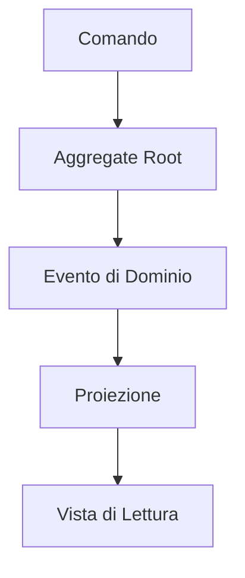

# Sourcing di Eventi in Laravel

**Una strategia oltre il CRUD**

Di Brent Roose

**EVENT-SOURCING-LARAVEL.COM | SPATIE**

---

## Introduzione all'Sourcing di Eventi in Laravel

**Un corso pratico per iniziare a utilizzare l'event sourcing in applicazioni di grandi dimensioni.**

Questo libro, pubblicato nel 2021 da Spatie, rappresenta una distillazione delle lezioni apprese dal team Spatie negli ultimi due anni. È stato rivisto da esperti come Freek Van der Herten e Matthias Noback, con design e composizione a cura di Sebastian De Deyne e Willem Van Bockstal.

> **Nota**: Per segnalare errori, contattare info@spatie.be.

---

## Indice dei Contenuti

- **Prefazione**
- **Introduzione**
- **Parte 1: Le Basi**
  - Design Orientato agli Eventi
  - Il Bus degli Eventi
  - Eventi
  - Modellazione del Mondo
  - Memorizzazione e Proiezione degli Eventi
  - Proiettori in Profondità
  - Query sugli Eventi
  - Reattori
  - Radici Aggregate
- **Parte 2: Pattern Avanzati**
  - Gestione dello Stato nelle Radici Aggregate
  - Parziali di Aggregati
  - Macchine a Stati con Parziali di Aggregati
  - Il Bus dei Comandi
  - CQRS
  - Saghe
- **Parte 3: Sfide con l'Event Sourcing**
  - Versionamento degli Eventi
  - Snapshotting
  - Microservizi
  - Event Sourcing Parziale
  - Strategie di Distribuzione
  - Note sull'Event Storming
  - Dettagli degni di Nota

### Diagramma: Architettura a Sourcing di Eventi


### Esempio: Implementazione di un Aggregate Root

```php
class Carrello extends AggregateRoot
{
    private string $idCarrello;
    private array $articoli = [];
    
    public static function crea(string $idCarrello, string $idUtente): self
    {
        $carrello = new self($idCarrello);
        $carrello->registraEvento(new CarrelloCreato($idCarrello, $idUtente));
        return $carrello;
    }
}
```

---

## Prefazione

Ti è mai capitato di guardare il tuo vecchio codice e pensare: "Cosa stavo facendo?" Dubito che esista un progetto in cui, dopo alcuni anni, non vorrei cambiare nulla o addirittura ricominciare da capo. Se sia una cosa produttiva da fare è un'altra questione, perché spesso non è la scelta più saggia, ma va bene così. Tuttavia, non riesco a scrollarmi di dosso il desiderio di aver saputo di più "all'epoca".

Ho iniziato a utilizzare questi sentimenti ogni volta che inizio un nuovo progetto. Penso ai progetti precedenti e alle loro difficoltà, cercando di evitarle ora che ho un foglio bianco. Guardando indietro agli ultimi tre progetti che ho fatto (ciascuno della durata di circa due anni), posso vedere come questa strategia abbia funzionato. Ogni nuovo progetto è stato migliore e più rifinito, costruito sulla base delle conoscenze dei precedenti. Dubito che questo processo di apprendimento si fermerà mai: man mano che le mie conoscenze e competenze crescono, sarò in grado di affrontare progetti più complessi, costringendomi a migliorare ulteriormente.

Per me, questo "ciclo di vita delle capacità di uno sviluppatore" – l'apprendimento costante, la crescita e il miglioramento, la scoperta di nuove cose, ancora e ancora – è ciò che rende questo lavoro prezioso.

Questo libro descrive il prossimo passo nel mio viaggio da sviluppatore e mira a insegnare anche a te. Lo considero il successore del mio libro precedente "Laravel Beyond CRUD" — non è necessario leggerlo per seguire questo, e questo libro non rende obsoleto "Laravel Beyond CRUD". Nel libro precedente, il mio collega Freek ha dichiarato: "Non esiste un approccio intrinsecamente giusto o sbagliato".

Posso concordare pienamente con questa affermazione: non esiste un modo giusto o sbagliato. Tuttavia, alcune tecniche potrebbero essere più adatte a progetti specifici, e questo libro esplorerà una di queste tecniche: un modo di progettare progetti con processi molto complessi che li rendono altamente flessibili e sostenibili. Imparerai nuovi modi di pensare al "flusso del programma" e semplificherai ciò che sembra essere processi estremamente complessi.

### Leggere Questo Libro

Tutti gli esempi sono scritti in PHP 8, e la maggior parte di essi sarà nel contesto di un'applicazione Laravel. Tuttavia, non è necessaria alcuna conoscenza preliminare di essi per seguire; puoi applicare gli stessi pattern e principi in qualsiasi progetto o framework.

Che tu abbia già esperienza teorica o pratica con l'event sourcing, o che tu non ne abbia mai sentito parlare, potrai imparare da questo libro. Inizieremo con le basi degli eventi e una mentalità orientata agli eventi, poi introdurremo le fondamenta dell'event sourcing e i pattern che ne derivano, e infine copriremo argomenti più approfonditi.

Quindi, se hai già familiarità con l'event sourcing, potresti scegliere di saltare la prima parte di questo libro o tornarci dopo aver letto gli argomenti più complessi.

### Test

Ogni volta che incontri un blocco come questo, ti mostrerà come testare componenti specifici. In particolare, la prima parte di questo libro si concentrerà su tutti i blocchi costitutivi necessari nel design orientato agli eventi e nell'event sourcing; è in questi capitoli che troverai questi blocchi di test dedicati.

Una funzionalità che useremo spesso quando scriviamo test sono le fabbriche di test. Sembrano così:

```php
CartItemAddedFactory::new()
    ->withProduct(
        ProductFactory::new()->withPrice(10_00)
    )
    ->create(),
```

A differenza delle fabbriche di modelli integrate di Laravel, avremo bisogno di un approccio più generale per costruire oggetti di test che non siano modelli, come gli eventi, ad esempio. Ecco perché useremo queste semplici classi di fabbrica. Se sei interessato a come funzionano, puoi controllare il codice sorgente che accompagna l'applicazione demo.

Tieni presente che il testing è cruciale quando si costruiscono applicazioni orientate agli eventi. So che a volte è allettante saltare i test e tornarci più tardi, quindi ho fatto del mio meglio per mantenere gli esempi il più brevi possibile e direttamente al punto.

Non saltare i test; ti risparmierai un sacco di problemi.

### Applicazione Demo

Insieme a questo corso viene fornita un'app demo: un carrello della spesa. Questo pacchetto è cresciuto per adattarsi alle esigenze di questo libro, ma potrebbe anche essere un punto di partenza per iniziare il tuo nuovo progetto di carrello della spesa reale. Faremo spesso riferimento all'app demo in tutto questo libro, quindi tienila sicuramente a portata di mano.

Riconosco che è impossibile scrivere un carrello della spesa che soddisfi le esigenze di tutti. Basandomi sulla mia esperienza, so che spesso ci sono molti piccoli dettagli e complessità che derivano dall'attività di un cliente, e non avrebbe senso cercare di codificare tutte queste possibilità in un unico pacchetto. Ecco perché, se vuoi usare questo codice come punto di partenza per il tuo nuovo progetto, sei libero di usarlo e modificarlo in qualsiasi modo richiesto dal tuo progetto.

Detto questo, è ora di immergerci. Spero che ti diverta!

---

## Diagramma SVG: Flusso di Event Sourcing

### Diagramma: Architettura a Sourcing di Eventi


### Esempio: Implementazione di un Aggregate Root

```php
class Carrello extends AggregateRoot
{
    private string $idCarrello;
    private array $articoli = [];
    
    public static function crea(string $idCarrello, string $idUtente): self
    {
        $carrello = new self($idCarrello);
        $carrello->registraEvento(new CarrelloCreato($idCarrello, $idUtente));
        return $carrello;
    }
}
```

Per comprendere meglio il concetto di event sourcing, ecco un diagramma che illustra il flusso tipico:

```svg
<svg width="800" height="400" xmlns="http://www.w3.org/2000/svg">
  <style>
    .box { fill: #f0f0f0; stroke: #000; stroke-width: 2; }
    .arrow { fill: none; stroke: #000; stroke-width: 2; marker-end: url(#arrowhead); }
    .text { font-family: Arial; font-size: 14px; }
    .title { font-family: Arial; font-size: 18px; font-weight: bold; }
  </style>
  <defs>
    <marker id="arrowhead" markerWidth="10" markerHeight="7" refX="0" refY="3.5" orient="auto">
      <polygon points="0 0, 10 3.5, 0 7" />
    </marker>
  </defs>
  <text x="400" y="30" text-anchor="middle" class="title">Flusso di Event Sourcing</text>
  <rect x="50" y="50" width="150" height="50" class="box" />
  <text x="125" y="75" text-anchor="middle" class="text">Evento Accade</text>
  <rect x="250" y="50" width="150" height="50" class="box" />
  <text x="325" y="75" text-anchor="middle" class="text">Evento Memorizzato</text>
  <rect x="450" y="50" width="150" height="50" class="box" />
  <text x="525" y="75" text-anchor="middle" class="text">Proiettore Aggiorna Modello di Lettura</text>
  <rect x="650" y="50" width="150" height="50" class="box" />
  <text x="725" y="75" text-anchor="middle" class="text">Reattore Gestisce Effetti Collaterali</text>
  <path d="M200,75 L250,75" class="arrow" />
  <path d="M400,75 L450,75" class="arrow" />
  <path d="M600,75 L650,75" class="arrow" />
  <rect x="50" y="150" width="150" height="50" class="box" />
  <text x="125" y="175" text-anchor="middle" class="text">Esempio: Aggiunta Articolo al Carrello</text>
  <rect x="250" y="150" width="150" height="50" class="box" />
  <text x="325" y="175" text-anchor="middle" class="text">Evento 'ArticoloAggiunto' Salvato</text>
  <rect x="450" y="150" width="150" height="50" class="box" />
  <text x="525" y="175" text-anchor="middle" class="text">Aggiornamento Vista Carrello</text>
  <rect x="650" y="150" width="150" height="50" class="box" />
  <text x="725" y="175" text-anchor="middle" class="text">Notifica Magazzino</text>
  <path d="M200,175 L250,175" class="arrow" />
  <path d="M400,175 L450,175" class="arrow" />
  <path d="M600,175 L650,175" class="arrow" />
</svg>
```

### Diagramma: Architettura a Sourcing di Eventi


### Esempio: Implementazione di un Aggregate Root

```php
class Carrello extends AggregateRoot
{
    private string $idCarrello;
    private array $articoli = [];
    
    public static function crea(string $idCarrello, string $idUtente): self
    {
        $carrello = new self($idCarrello);
        $carrello->registraEvento(new CarrelloCreato($idCarrello, $idUtente));
        return $carrello;
    }
}
```

Questo diagramma mostra il flusso dell'event sourcing, dove un evento accade, viene memorizzato, poi proiettato in un modello di lettura, e infine gestito da un reattore per effetti collaterali come notifiche. Un esempio pratico è l'aggiunta di un articolo al carrello, che genera un evento, aggiorna la vista del carrello e notifica il magazzino.

---

## Esempio Pratico: Carrello della Spesa

Per illustrare l'applicazione dell'event sourcing, consideriamo un'applicazione demo di un carrello della spesa. Supponiamo che un cliente aggiunga un articolo al carrello:

1. **Evento Generato**: `ArticoloAggiuntoAlCarrello` con dettagli come ID articolo, quantità e prezzo.
2. **Memorizzazione**: Questo evento viene salvato nel database degli eventi.
3. **Proiezione**: Un proiettore aggiorna la vista del carrello per mostrare il nuovo articolo.
4. **Reazione**: Un reattore potrebbe ridurre l'inventario del prodotto e inviare una notifica al cliente.

**Codice Esempio in PHP/Laravel**:

```php
// Definizione dell'evento
class ArticoloAggiuntoAlCarrello {
    public function __construct(
        public string $carrelloUuid,
        public string $articoloId,
        public int $quantita,
        public float $prezzo
    ) {}
}

// Proiettore per aggiornare la vista del carrello
class ProiettoreCarrello {
    public function suArticoloAggiunto(ArticoloAggiuntoAlCarrello $evento, string $carrelloUuid) {
        Carrello::aggiorna([
            'uuid' => $carrelloUuid,
            'articoli' => $this->calcolaNuoviArticoli($evento),
        ]);
    }
}

// Reattore per gestire l'inventario
class ReattoreInventario {
    public function suArticoloAggiunto(ArticoloAggiuntoAlCarrello $evento) {
        Prodotto::trova($evento->articoloId)->decrementaInventario($evento->quantita);
    }
}
```

Questo esempio mostra come un singolo evento può innescare aggiornamenti multipli e azioni collaterali, mantenendo un registro storico completo di tutte le modifiche.

---

## Conclusione

L'event sourcing offre un approccio potente per gestire la complessità delle applicazioni, specialmente in contesti come il commercio elettronico o, nel nostro caso, applicazioni sanitarie come `saluteora`, dove la tracciabilità e l'auditabilità sono cruciali. Con l'uso di eventi, proiettori e reattori, possiamo costruire sistemi flessibili e mantenibili che registrano ogni cambiamento di stato, facilitando la conformità e l'analisi storica.

Se hai bisogno di ulteriori dettagli su come applicare questi concetti in `saluteora`, fammi sapere!