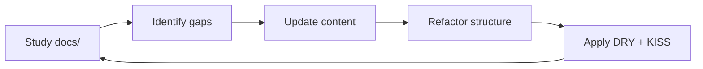
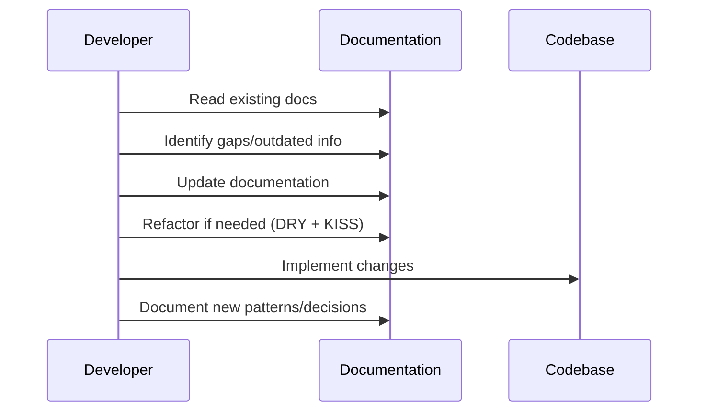

# Documentation Management Guidelines

## Documentation as Memory System

**CRITICAL**: The `docs/` directories throughout this project serve as your **memory system**. You must constantly study and update these directories to maintain accurate, current, and useful documentation.

## Core Documentation Philosophy

### 1. Documentation is Living Memory

```
docs/ directories = AI Memory System
├── Current knowledge state
├── Architectural decisions  
├── Implementation patterns
├── Lessons learned
└── Best practices evolved
```

### 2. Continuous Learning Cycle



## Documentation Locations

### 1. Project-Level Documentation

```
laravel/.ai/guidelines/          # AI development guidelines
├── README.md                    # Master index
├── architecture-patterns.md    # Core patterns
├── environment-configuration.md # Config system
└── [other-guidelines].md
```

### 2. Module-Level Documentation

```
Modules/[Module]/docs/
├── readme.md                    # Module overview
├── architecture.md              # Module architecture
├── api-endpoints.md            # API documentation
├── troubleshooting.md          # Common issues
└── [feature-specific].md       # Feature docs
```

### 3. Theme Documentation

```
Themes/One/docs/
├── README.md                    # Theme overview
├── build-process.md            # Build system
├── theme-structure.md          # File structure
├── components.md               # UI components
└── customization.md            # Customization guide
```

## Documentation Management Rules

### 1. Continuous Study Pattern

**MUST DO** before any development work:

```bash
# 1. Study relevant documentation
find . -name "docs" -type d | while read dir; do
    echo "Studying: $dir"
    ls -la "$dir"/*.md 2>/dev/null
done

# 2. Identify outdated or missing information
# 3. Update documentation BEFORE coding
# 4. Refactor documentation structure if needed
```

### 2. Update-Before-Code Principle



## DRY + KISS Refactoring Guidelines

### 1. DRY (Don't Repeat Yourself) in Documentation

#### ❌ Before - Repetitive Documentation

```markdown
<!-- modules/user/docs/api.md -->
## Authentication
Users must authenticate using JWT tokens...

<!-- modules/auth/docs/api.md -->  
## Authentication
Users must authenticate using JWT tokens...

<!-- modules/admin/docs/api.md -->
## Authentication  
Users must authenticate using JWT tokens...
```

#### ✅ After - DRY Documentation

```markdown
<!-- .ai/guidelines/authentication.md -->
# Authentication System
JWT token-based authentication used across all modules...

<!-- modules/user/docs/api.md -->
## Authentication
See [Authentication System](../../../.ai/guidelines/authentication.md)

<!-- modules/auth/docs/api.md -->
## Authentication  
See [Authentication System](../../../.ai/guidelines/authentication.md)
```

### 2. KISS (Keep It Simple, Stupid) in Documentation

#### ❌ Before - Complex Structure

```
docs/
├── advanced-architectural-design-patterns-and-implementation-strategies.md
├── comprehensive-development-workflow-with-testing-and-deployment.md
├── detailed-configuration-management-system-documentation.md
└── extensive-troubleshooting-and-debugging-methodologies.md
```

#### ✅ After - Simple Structure

```
docs/
├── architecture.md
├── workflow.md  
├── configuration.md
└── troubleshooting.md
```

### 3. Content Simplification Examples

#### ❌ Complex Content

```markdown
# Comprehensive Analysis of the Multi-Layered Architectural Implementation

This document provides an extensive, detailed examination of the sophisticated multi-layered architectural implementation patterns utilized throughout the comprehensive modular system architecture, including but not limited to the various interconnected components, subsystems, and their complex interdependencies...

## Table of Contents
1. Introduction to Complex Systems
2. Detailed Architectural Overview  
3. Comprehensive Implementation Strategies
4. Advanced Configuration Methodologies
...
```

#### ✅ Simple Content (KISS)

```markdown
# Architecture

This project uses a modular architecture with the following key components:

- **Modules**: Self-contained functionality units
- **XotBase Classes**: Shared base functionality  
- **Actions**: Business logic implementation
- **Widgets**: UI components

## Quick Start

1. Extend XotBase classes
2. Use Actions for business logic
3. Create Widgets for UI
```

## Documentation Refactoring Process

### 1. Analysis Phase

```php
// Checklist for documentation analysis
$analysis = [
    'redundancy' => 'Find repeated information across files',
    'complexity' => 'Identify overly complex explanations',
    'outdated' => 'Spot outdated information',
    'gaps' => 'Find missing documentation',
    'structure' => 'Evaluate file organization',
    'navigation' => 'Check cross-references and links'
];
```

### 2. Refactoring Actions

```bash
# Step 1: Identify duplicated content
grep -r "same pattern" docs/ | cut -d: -f1 | sort | uniq -c

# Step 2: Extract common patterns to shared files
# Move repeated content to .ai/guidelines/

# Step 3: Simplify complex files
# Break down large files into focused, single-purpose files

# Step 4: Update cross-references
# Ensure all links work after refactoring
```

### 3. Quality Checks

```markdown
## Documentation Quality Checklist

### DRY Compliance
- [ ] No repeated explanations across files
- [ ] Common patterns extracted to shared guidelines
- [ ] Cross-references used instead of duplication

### KISS Compliance  
- [ ] Simple, clear explanations
- [ ] Minimal technical jargon
- [ ] Focused, single-purpose files
- [ ] Logical file organization

### Accuracy
- [ ] All information current and correct
- [ ] Code examples work and follow patterns
- [ ] Links and references functional
```

## File Naming Standards

### 1. Consistent Naming Pattern

**ALWAYS lowercase** (except README.md):

```bash
# ✅ CORRECT
docs/
├── README.md                    # Exception - uppercase
├── architecture-patterns.md
├── coding-standards.md
├── user-authentication.md
└── database-configuration.md

# ❌ WRONG - Mixed case
docs/
├── ArchitecturePatterns.md     # DON'T DO THIS
├── CODING_STANDARDS.md         # DON'T DO THIS
├── UserAuthentication.md       # DON'T DO THIS
```

### 2. Descriptive Naming

```bash
# ✅ GOOD - Descriptive and specific
theme-customization-guide.md
filament-widget-patterns.md
database-optimization-strategies.md

# ❌ BAD - Vague or generic
guide.md
patterns.md
optimization.md
```

## Maintenance Workflow

### 1. Weekly Documentation Review

```bash
#!/bin/bash
# Weekly documentation maintenance script

echo "=== Weekly Documentation Review ==="

# Find all docs directories
find . -name "docs" -type d | while read docs_dir; do
    echo "Reviewing: $docs_dir"
    
    # Check for outdated files (older than 30 days with no updates)
    find "$docs_dir" -name "*.md" -mtime +30 -ls
    
    # Look for TODO or FIXME comments
    grep -r "TODO\|FIXME\|XXX" "$docs_dir" 2>/dev/null
done
```

### 2. Documentation Update Triggers

Update documentation when:

```php
$update_triggers = [
    'new_feature' => 'Add feature documentation',
    'bug_fix' => 'Update troubleshooting guide',
    'architecture_change' => 'Update architectural docs',
    'api_change' => 'Update API documentation',
    'configuration_change' => 'Update config documentation',
    'pattern_evolution' => 'Update pattern guidelines'
];
```

### 3. Monthly Refactoring Session

```markdown
## Monthly Documentation Refactoring

### Goals
- Eliminate redundancy (DRY)
- Simplify complex explanations (KISS)
- Update outdated information
- Improve navigation and structure

### Process
1. **Audit**: Review all documentation for redundancy
2. **Extract**: Move common patterns to shared files
3. **Simplify**: Rewrite complex sections using KISS
4. **Reorganize**: Improve file structure and naming
5. **Validate**: Test all links and code examples
6. **Index**: Update README files with current structure
```

## Documentation Templates

### 1. Module Documentation Template

```markdown
# [Module Name]

Brief description of module purpose.

## Architecture

- **Models**: List key models
- **Resources**: List Filament resources  
- **Actions**: List business logic actions
- **Widgets**: List UI widgets

## Configuration

Key configuration options in `config/local/[env]/[module].php`

## Usage Examples

Practical examples of common tasks.

## Troubleshooting

Common issues and solutions.

## See Also

- [Related Module](../other-module/docs/readme.md)
- [Pattern Guide](../../.ai/guidelines/pattern-name.md)
```

### 2. Feature Documentation Template

```markdown
# [Feature Name]

## Overview

What this feature does and why it exists.

## Implementation

How it's implemented (brief, link to code).

## Usage

How to use this feature.

## Configuration

Any configuration options.

## Examples

Practical examples.

## Related

Links to related documentation.
```

## Integration with Development Workflow

### 1. Before Development

```bash
# Always start with documentation review
cd project-root

# Study existing documentation
find . -name "docs" -exec ls -la {} \;

# Check for gaps or outdated info
grep -r "TODO\|FIXME\|OUTDATED" */docs/

# Update documentation BEFORE coding
```

### 2. During Development

```bash
# Document decisions as you make them
echo "# Decision: Why X approach over Y" >> docs/decisions.md

# Update relevant documentation
# Don't wait until end of development
```

### 3. After Development

```bash
# Final documentation update
# Refactor if needed (apply DRY + KISS)
# Update cross-references
# Test all examples
```

## Quality Metrics

### 1. Documentation Health Indicators

```php
$health_metrics = [
    'coverage' => 'Percentage of features documented',
    'freshness' => 'Average age of documentation updates',
    'accuracy' => 'Percentage of working code examples',
    'redundancy' => 'Amount of duplicated content',
    'complexity' => 'Average reading complexity score',
    'navigation' => 'Percentage of working internal links'
];
```

### 2. Refactoring Success Metrics

```php
$refactoring_success = [
    'dry_improvement' => 'Reduction in duplicated content',
    'simplification' => 'Reduction in file complexity',
    'organization' => 'Improvement in navigation efficiency',
    'maintainability' => 'Ease of keeping docs updated'
];
```

## Summary

- **Documentation = Memory**: Treat docs/ as your knowledge base
- **Study Continuously**: Regular review and updates required
- **Update Before Code**: Documentation drives development
- **Apply DRY**: Extract common patterns to shared files
- **Apply KISS**: Simple, clear, focused documentation
- **Consistent Naming**: All lowercase (except README.md)
- **Refactor Regularly**: Monthly structure and content review
- **Quality Focus**: Accurate, current, useful information