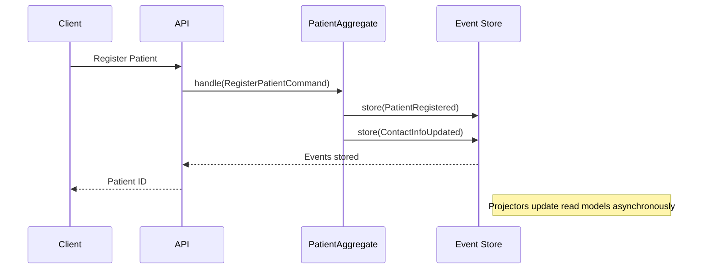

# Advanced Event Sourcing Patterns for Healthcare Applications

## Table of Contents
- [Introduction](#introduction)
- [Core Concepts](#core-concepts)
- [Implementation in Healthcare](#implementation-in-healthcare)
- [Practical Examples](#practical-examples)
- [Performance Considerations](#performance-considerations)
- [Best Practices](#best-practices)
- [Real-world Use Cases](#real-world-use-cases)

## Introduction

Event Sourcing is particularly valuable in healthcare applications like `saluteora` where data integrity, audit trails, and historical tracking are crucial. This document expands on the basic concepts with advanced patterns and practical implementations.

## Core Concepts

### 1. Event Sourcing Fundamentals
- **Events as Source of Truth**: Store all state changes as immutable events
- **Event Store**: Append-only database for events
- **Projections**: Materialized views built from events
- **CQRS**: Separate read and write models

### 2. Advanced Patterns
- **Aggregate Roots**: Transactional boundaries and consistency
- **Sagas/Process Managers**: Complex workflows across aggregates
- **Event Versioning**: Handling schema evolution
- **Snapshots**: Performance optimization for large aggregates

## Implementation in Healthcare

### Patient Management


### Medical Record System
- Each medical interaction generates events
- Full audit trail of all changes
- Temporal queries ("show me the record as of last Tuesday")

## Practical Examples

### 1. Prescription Management
```php
class PrescriptionAggregate extends AggregateRoot
{
    private array $medications = [];
    private bool $isApproved = false;
    
    public function prescribe(
        string $patientId, 
        string $medicationId, 
        string $dosage,
        string $doctorId
    ): void {
        $this->recordThat(new MedicationPrescribed(
            prescriptionId: $this->uuid(),
            patientId: $patientId,
            medicationId: $medicationId,
            dosage: $dosage,
            prescribedBy: $doctorId,
            prescribedAt: now()
        ));
    }
    
    protected function applyMedicationPrescribed(MedicationPrescribed $event): void
    {
        $this->medications[$event->medicationId] = [
            'dosage' => $event->dosage,
            'status' => 'active',
            'prescribed_at' => $event->prescribedAt
        ];
    }
}
```

### 2. Appointment Scheduling
```php
class ScheduleAppointmentHandler
{
    public function __construct(
        private EventBus $eventBus,
        private AppointmentRepository $appointments
    ) {}
    
    public function handle(ScheduleAppointmentCommand $command): void
    {
        $appointment = Appointment::schedule(
            $command->appointmentId,
            $command->patientId,
            $command->doctorId,
            $command->scheduledTime,
            $command->duration
        );
        
        $this->appointments->save($appointment);
        
        $this->eventBus->publish(new AppointmentScheduled(
            $appointment->id,
            $appointment->patientId,
            $appointment->doctorId,
            $appointment->scheduledTime,
            $appointment->duration
        ));
    }
}
```

## Performance Considerations

### 1. Snapshotting
```php
class PatientAggregate extends AggregateRoot
{
    private int $version = 0;
    private array $events = [];
    
    public static function reconstituteFromEvents(UuidInterface $uuid, array $events): self
    {
        $aggregate = new static($uuid);
        
        // Apply all events
        foreach ($events as $event) {
            $aggregate->apply($event);
            $aggregate->version++;
        }
        
        return $aggregate;
    }
    
    public function snapshot(): PatientSnapshot
    {
        return new PatientSnapshot([
            'aggregate_id' => $this->uuid->toString(),
            'version' => $this->version,
            'state' => [
                // Current state properties
            ]
        ]);
    }
}
```

### 2. Read Model Optimization
- Use dedicated read models for common queries
- Implement caching strategies
- Consider eventual consistency where appropriate

## Best Practices

### 1. Event Design
- Keep events small and focused
- Use past tense for event names
- Include all necessary context
- Make events immutable

### 2. Testing
```php
class PatientRegistrationTest extends TestCase
{
    /** @test */
    public function it_registers_a_new_patient()
    {
        $patientId = PatientId::generate();
        
        $this->given()
            ->when(new RegisterPatient($patientId, 'John', 'Doe', 'john@example.com'))
            ->then([
                new PatientRegistered($patientId, 'John', 'Doe', 'john@example.com')
            ]);
    }
}
```

### 3. Monitoring and Maintenance
- Monitor event store growth
- Archive old events when necessary
- Implement proper backup strategies

## Real-world Use Cases

### 1. Audit Trail
- Track all changes to patient records
- Support for regulatory compliance (HIPAA, GDPR)
- Forensic analysis of data changes

### 2. Temporal Queries
- View patient history at any point in time
- Reconstruct state for specific dates
- Support for "what if" scenarios

### 3. Integration with External Systems
- Publish events to message queues
- React to external events
- Maintain consistency across services

## Conclusion

Event Sourcing provides a robust foundation for healthcare applications by ensuring data integrity, auditability, and flexibility. By implementing these advanced patterns, `saluteora` can build a system that not only meets current requirements but can also evolve with future needs.

## References
- [Event Sourcing in Laravel by Brent Roose](https://event-sourcing-laravel.com/)
- [Spatie Laravel Event Sourcing Documentation](https://spatie.be/docs/laravel-event-sourcing/v7/)
- [Domain-Driven Design by Eric Evans](https://domainlanguage.com/ddd/)
