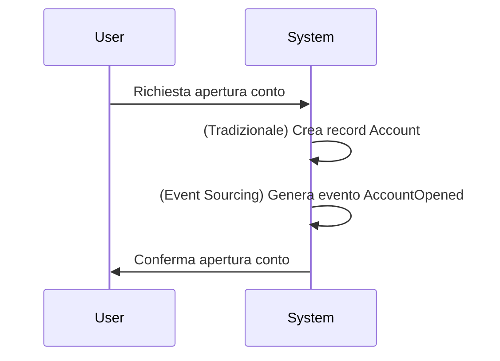
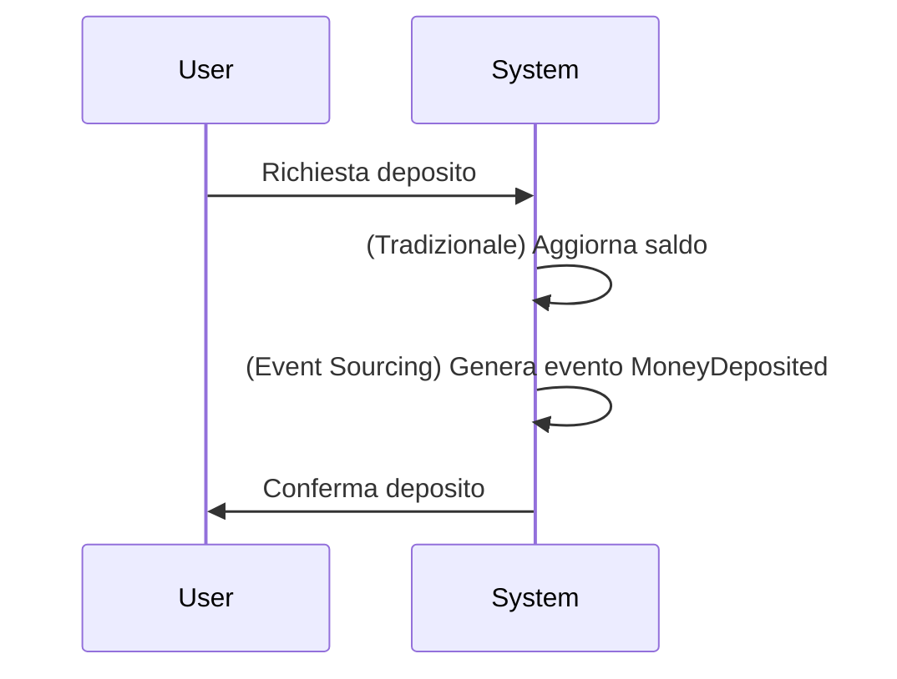
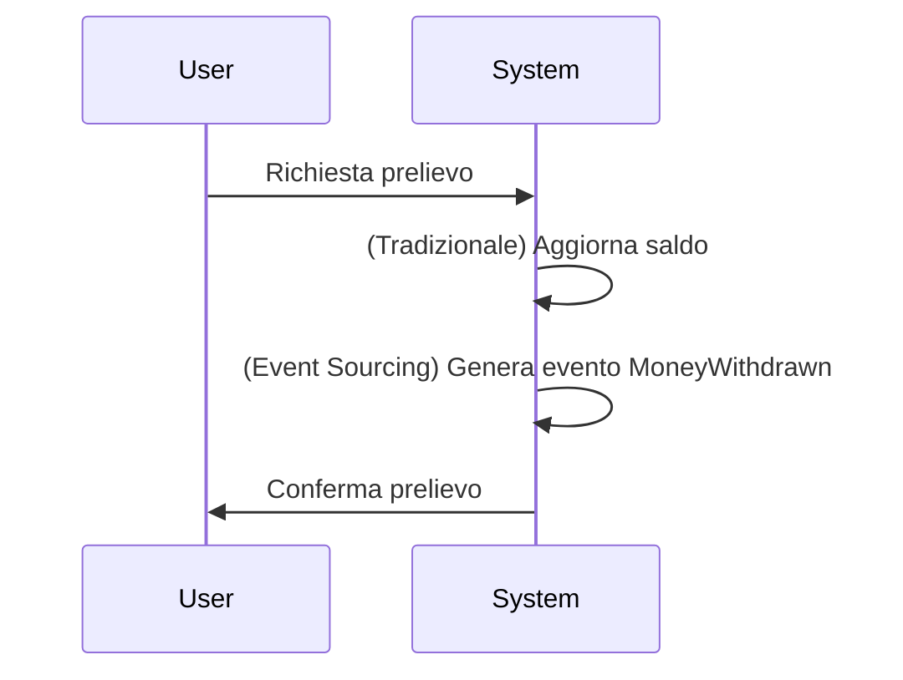
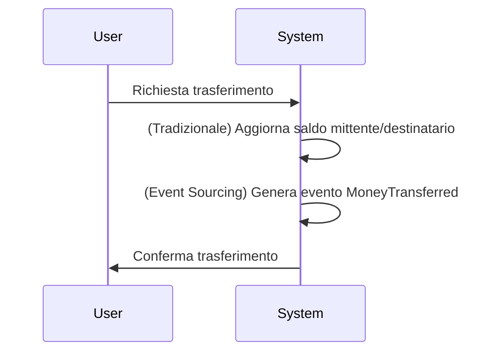

# Flussi Principali - Use Case Bancario

## 1. Apertura Conto

## 2. Deposito

## 3. Prelievo

## 4. Trasferimento

## 5. Audit e Rollback
- (Tradizionale) Audit limitato, rollback manuale
- (Event Sourcing) Audit completo, rollback tramite replay eventi o snapshot 
