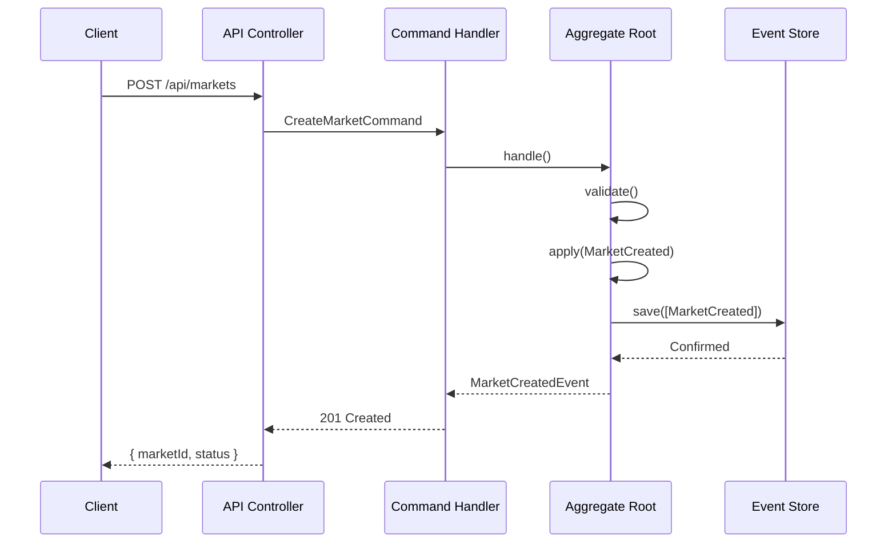
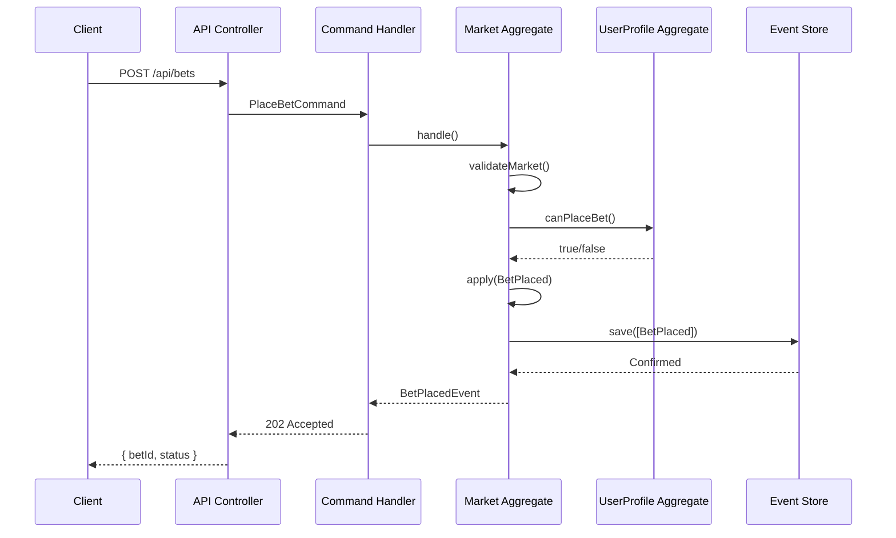

# 🏗️ Architettura del Modulo Prediction Market

## 🌟 Panoramica dell'Architettura

L'architettura del modulo Prediction Market è progettata seguendo i principi del **Domain-Driven Design (DDD)** e dell'**Event Sourcing**, garantendo scalabilità, manutenibilità e tracciabilità completa di tutte le operazioni.

## 🧱 Componenti Fondamentali

### 1. Dominio (Domain Layer)

#### Aggregate Roots

##### Market Aggregate
- **Responsabilità**:
  - Gestione del ciclo di vita del mercato (creazione, aggiornamento, chiusura)
  - Validazione delle operazioni in base allo stato corrente
  - Emissione di eventi di dominio
- **Regole di Business**:
  - Un mercato può accettare scommesse solo se nello stato `OPEN`
  - Le quote vengono ricalcolate ad ogni scommessa secondo la regola LMSR (Logarithmic Market Scoring Rule) per garantire prezzi dinamici e liquidità automatica
  - La risoluzione è consentita solo dopo la data di chiusura

##### UserBettingProfile Aggregate
- **Responsabilità**:
  - Gestione del saldo utente
  - Tracciamento delle scommesse attive
  - Validazione della capacità di scommessa

#### Value Objects
- `MarketId`: Identificatore univoco del mercato (UUID v4)
- `UserId`: Identificativo dell'utente
- `BetId`: Identificativo univoco della scommessa
- `Money`: Value object per gestire gli importi monetari
- `Odds`: Calcolo e gestione delle quote
- `TimeRange`: Periodo di validità del mercato

### 2. Applicazione (Application Layer)

#### Comandi (Commands)
- `CreateMarketCommand`: Crea un nuovo mercato
- `PlaceBetCommand`: Registra una nuova scommessa
- `CancelBetCommand`: Annulla una scommessa esistente
- `ResolveMarketCommand`: Risolve un mercato con l'esito
- `DistributePayoutsCommand`: Distribuisce i pagamenti

#### Query (Queries)
- `GetActiveMarketsQuery`: Elenca i mercati aperti
- `GetMarketDetailsQuery`: Dettagli di un mercato specifico
- `GetUserBetsQuery`: Storico scommesse utente
- `GetMarketOddsQuery`: Quote aggiornate di un mercato

### 3. Infrastruttura (Infrastructure Layer)

#### Repository
- `MarketRepository`: Gestisce il salvataggio/recupero degli aggregate
- `UserBettingProfileRepository`: Gestisce i profili di scommessa
- `EventStore`: Memorizza gli eventi in modo persistente

#### Proiezioni (Projections)
- `MarketStatusProjection`: Stato corrente dei mercati
- `UserBalanceProjection`: Saldo e storico transazioni
- `MarketOddsProjection`: Calcolo in tempo reale delle quote
- `BetHistoryProjection`: Storico delle scommesse con filtri

#### Process Manager
- `BettingProcessManager`: Gestisce i flussi di lavoro complessi
- `PayoutProcessManager`: Coordina la distribuzione dei pagamenti

## Lezioni Apprese dai Progetti Spatie

Analizzando i progetti `laravel-shop-main` e `laravel-shop-command-bus`, ho identificato diversi principi architetturali che possono essere applicati al nostro mercato delle previsioni:

- **Event Sourcing come Fondamento**: Entrambi i progetti utilizzano Event Sourcing per tracciare ogni modifica allo stato del sistema (es. aggiunta di un articolo al carrello). Nel contesto del mercato delle previsioni, possiamo usare eventi come `PredictionMade`, `MarketResolved` o `BetPlaced` per costruire una storia immutabile delle interazioni degli utenti. Questo garantisce tracciabilità e auditabilità, cruciali per un sistema che gestisce scommesse o previsioni.
- **Aggregate Root per la Logica di Business**: Nei progetti Spatie, gli aggregate come `CartAggregateRoot` centralizzano la logica di business, decidendo quali eventi generare in risposta a comandi. Per il nostro sistema, possiamo creare un `MarketAggregate` che gestisce la creazione di mercati, l'accettazione di previsioni e la risoluzione dei risultati.
- **Proiettori per Viste Ottimizzate**: Spatie utilizza proiettori per trasformare eventi in viste ottimizzate per le query (es. una tabella che mostra il contenuto del carrello). Possiamo adottare lo stesso approccio per generare viste in tempo reale delle classifiche degli utenti, dei mercati attivi e dei risultati storici.

## Struttura Modulare e Domain-Driven Design

Basandoci sulla documentazione di Laravel Modules ([https://laravelmodules.com/docs/12/getting-started/introduction](https://laravelmodules.com/docs/12/getting-started/introduction)), possiamo strutturare il nostro mercato delle previsioni come un modulo isolato all'interno del progetto più ampio:

- **Isolamento del Modulo**: Creare un modulo `PredictionMarket` in `Modules/PredictionMarket` ci permette di sviluppare e testare il sistema in modo indipendente, con la possibilità di riutilizzarlo in altri progetti. Questo modulo avrà la propria struttura di directory con `app`, `config`, `database`, ecc.
- **Organizzazione DDD Interna**: All'interno del modulo, possiamo adottare una struttura ispirata al Domain-Driven Design, simile a quella di Spatie. Ad esempio, `Modules/PredictionMarket/app/Domain/Market` conterrà aggregate, eventi e proiettori relativi ai mercati delle previsioni.

## Architettura Proposta

### Componenti Principali

- **Modulo PredictionMarket**: Isolato e riutilizzabile, contiene tutta la logica del mercato delle previsioni.
- **Domain/Market**: Contiene `MarketAggregate` per la logica di business, eventi come `PredictionMade` e proiettori per viste come `MarketSummary`.
- **Domain/UserPrediction**: Gestisce le previsioni degli utenti con eventi come `BetPlaced` e viste per le statistiche personali.
- **Controllers**: Punti di ingresso per comandi utente, come creare un mercato o fare una previsione.
- **Projections**: Tabelle ottimizzate per query, come classifiche e mercati attivi.

### Flusso di Dati

1. Un utente invia un comando tramite un controller (es. creare un mercato).
2. L'aggregate `MarketAggregate` valida il comando e genera eventi (es. `MarketCreated`).
3. Gli eventi sono salvati nel database per la tracciabilità (Event Sourcing).
4. I proiettori aggiornano viste ottimizzate per le query (es. una lista di mercati attivi).
5. Le viste sono utilizzate per mostrare dati agli utenti in modo efficiente.

### Vantaggi di Questo Approccio

- **Tracciabilità**: Grazie a Event Sourcing, ogni azione nel mercato delle previsioni è registrata come evento, garantendo un audit trail completo.
- **Scalabilità**: La struttura modulare consente di sviluppare e distribuire il sistema indipendentemente, mentre l'organizzazione DDD mantiene la logica di business chiara.
- **Manutenzione**: La separazione tra logica di scrittura (aggregate) e lettura (proiettori) facilita gli aggiornamenti e le ottimizzazioni.

## Flusso dei Dati

### 4. Interfaccia (Interface Layer)

#### API REST
- `MarketController`: Gestione mercati
- `BetController`: Gestione scommesse
- `ReportController`: Generazione report

#### Comandi Console
```bash

# Gestione Mercati
market:create
market:close
market:resolve

# Gestione Scommesse
bet:place
bet:cancel
bet:refund

# Report e Manutenzione
market:report
user:balance:recalculate
```

## 🔄 Flusso dei Dati

### 1. Flusso di Creazione Mercato


### 2. Flusso di Piazzamento Scommessa


## 🏗️ Modello dei Dati

### Modello Eventi
```typescript
interface MarketCreated {
  eventType: 'MarketCreated';
  marketId: string;
  title: string;
  description: string;
  outcomes: string[];
  opensAt: string;
  closesAt: string;
  createdBy: string;
  createdAt: string;
}

interface BetPlaced {
  eventType: 'BetPlaced';
  betId: string;
  marketId: string;
  userId: string;
  outcome: string;
  amount: number;
  odds: number;
  placedAt: string;
}
```

### Modello di Lettura
```sql
CREATE TABLE market_summaries (
  id UUID PRIMARY KEY,
  title VARCHAR(255) NOT NULL,
  status ENUM('PENDING', 'OPEN', 'CLOSED', 'RESOLVED') NOT NULL,
  total_bets INT DEFAULT 0,
  total_amount DECIMAL(15, 2) DEFAULT 0.00,
  winning_outcome VARCHAR(255) NULL,
  created_at TIMESTAMP NOT NULL,
  updated_at TIMESTAMP NOT NULL,
  resolved_at TIMESTAMP NULL
);

CREATE TABLE user_bets (
  id UUID PRIMARY KEY,
  market_id UUID NOT NULL,
  user_id UUID NOT NULL,
  outcome VARCHAR(255) NOT NULL,
  amount DECIMAL(15, 2) NOT NULL,
  potential_payout DECIMAL(15, 2) NOT NULL,
  status ENUM('PENDING', 'WON', 'LOST', 'CANCELLED') NOT NULL,
  placed_at TIMESTAMP NOT NULL,
  resolved_at TIMESTAMP NULL,
  FOREIGN KEY (market_id) REFERENCES market_summaries(id)
);
```

## 🛡️ Considerazioni sulla Sicurezza

1. **Autenticazione e Autorizzazione**
   - Tutti gli endpoint richiedono autenticazione JWT
   - Controlli di autorizzazione basati sui ruoli (USER, MARKET_MAKER, ADMIN)
   - Validazione degli input per prevenire SQL injection e XSS

2. **Protezione Dati**
   - Crittografia dei dati sensibili a riposo
   - Mascheramento delle informazioni sensibili nei log
   - Audit trail completo di tutte le operazioni

3. **Conformità**
   - GDPR per la gestione dei dati personali
   - KYC/AML per i pagamenti
   - Conservazione dei registri secondo le normative

## ⚡ Ottimizzazioni delle Performance

1. **Caching**
   - Cache Redis per le query più frequenti
   - Cache a più livelli (application, database, CDN)
   - Invalidazione intelligente della cache basata sugli eventi

2. **Elaborazione Asincrona**
   - Code di lavoro per operazioni pesanti
   - Elaborazione in batch per i report
   - WebSockets per aggiornamenti in tempo reale

3. **Ottimizzazioni del Database**
   - Indicizzazione ottimizzata per le query più comuni
   - Partizionamento delle tabelle di grandi dimensioni
   - Archiviazione a caldo/freddo per i dati storici

## 📈 Metriche e Monitoraggio

1. **Metriche Chiave**
   - Numero di mercati attivi
   - Volume delle scommesse
   - Tempo di risposta medio delle API
   - Tasso di conversione (visite → scommesse)

2. **Allarmi**
   - Errori di validazione
   - Tempi di risposta elevati
   - Tassi di errore delle API
   - Anomalie nei volumi di scommesse

## 🔄 Deployment e Scalabilità

### Configurazione Consigliata
- **Web Server**: 2+ istanze con bilanciamento del carico
- **Database**: Replica master-slave con letture scalabili
- **Cache**: Cluster Redis con persistenza
- **Code**: RabbitMQ o AWS SQS
- **Storage**: S3 compatibile per i file

### Strategie di Scalabilità
- **Orizzontale**: Aggiunta di nuovi nodi al cluster
- **Verticale**: Upgrade delle risorse dei server esistenti
- **Sharding**: Partizionamento dei dati per mercato/utente

## 🧪 Testing

### Test Unitari
- Test delle regole di business negli aggregate
- Test dei value objects
- Test degli handler dei comandi

### Test di Integrazione
- Test end-to-end dei flussi principali
- Test di persistenza degli eventi
- Test delle proiezioni

### Test di Performance
- Test di carico con migliaia di richieste concorrenti
- Test di stress per identificare i colli di bottiglia
- Benchmark delle query più critiche

## 🔄 Manutenzione e Operazioni

### Backup
- Backup incrementali ogni ora
- Backup completi giornalieri
- Test di ripristino settimanali

### Manutenzione Programmata
- Pulizia dei dati obsoleti
- Ricalcolo periodico delle statistiche
- Ottimizzazione degli indici del database

## 🔮 Roadmap Futura

1. **Integrazione con Pagamenti**
   - Supporto per più gateway di pagamento
   - Criptovalute e stablecoin
   - Sistemi di referral e bonus

2. **Funzionalità Avanzate**
   - Mercati condizionali
   - Scommesse in-game
   - Social features e competizioni

3. **Miglioramenti Tecnici**
   - Migrazione a microservizi
   - Implementazione di CQRS avanzato
   - Ottimizzazioni blockchain per la trasparenza
3. **Evento**: Se valido, un evento viene generato e registrato nel flusso di eventi.
4. **Applicazione**: L'evento viene applicato alla radice aggregate per aggiornare lo stato.
5. **Proiezione**: I proiettori ascoltano l'evento e aggiornano i modelli di lettura.
6. **Query**: Le interfacce utente o API interrogano i modelli di lettura per mostrare dati aggiornati.

## Schema Architetturale

```
[Comando] --> [Radice Aggregate] --> [Eventi] --> [Flusso Eventi]
                                                  |
                                           [Proiettori]
                                                  |
                                        [Modelli di Lettura] --> [UI/API]
```

## Considerazioni Tecniche

- **Persistenza Eventi**: Gli eventi sono salvati in un database (es. tabella `events`) con metadati (UUID, tipo evento, dati, timestamp).
- **Rigiocata Eventi**: In caso di necessità, gli eventi possono essere rigiocati per ricostruire lo stato o creare nuovi modelli di lettura.
- **Snapshot**: Per mercati con molte scommesse, salvare snapshot periodici dello stato della radice aggregate per ridurre il numero di eventi da rigiocare.
- **Scalabilità**: Utilizzare code (es. Laravel Queue) per processare eventi e proiezioni in background.

## Conclusione

Questa architettura separa chiaramente le responsabilità tra logica di business (radice aggregate), registrazione storica (eventi) e query ottimizzate (proiettori e modelli di lettura). L'Event Sourcing garantisce tracciabilità e flessibilità, rendendo il sistema di Prediction Market scalabile e manutenibile.
