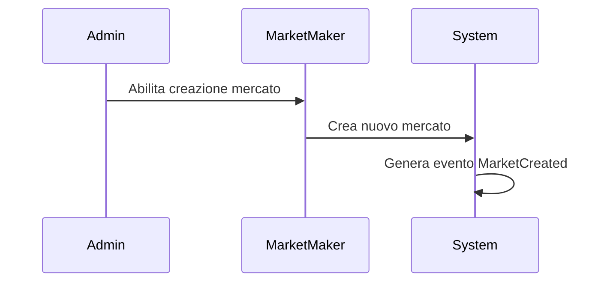
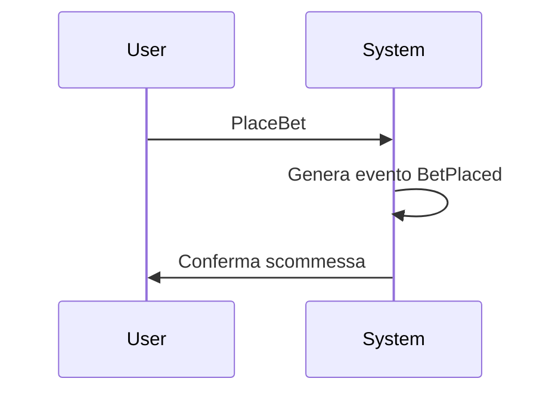
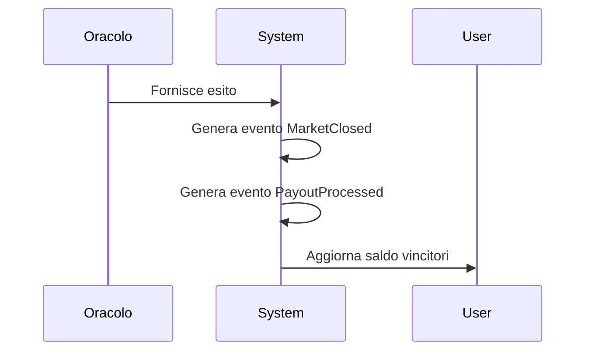

# Flusso degli Eventi - Prediction Market

## 1. Creazione Mercato

## 2. Piazzamento Scommessa

## 3. Chiusura Mercato e Payout

## 4. Audit Trail e Rollback
- Tutti gli eventi sono persistiti e possono essere rigiocati per ricostruire lo stato
- Possibilità di rollback tramite snapshot e replay 
