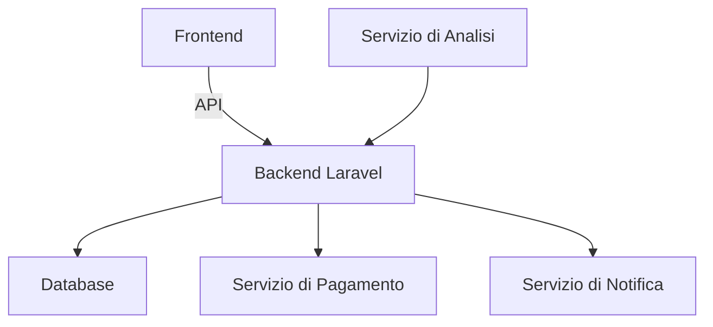

# Casi d'Uso del Prediction Market

## 1. Previsioni Economiche

### 1.1 Previsioni sui Tassi di Interesse
- **Descrizione**: Permettere agli investitori di scommettere sulle variazioni dei tassi di interesse.
- **Flusso Utente**:
  1. Creazione di un mercato per un determinato tasso di interesse
  2. Gli utenti acquistano/vendono contratti basati sulle loro previsioni
  3. Alla scadenza, il mercato si risolve in base al tasso effettivo

### 1.2 Previsioni sul PIL
- **Descrizione**: Creare mercati per la crescita del PIL trimestrale o annuale.
- **Metriche Chiave**:
  - Accuratezza delle previsioni
  - Volume degli scambi
  - Numero di partecipanti

## 2. Mercati Politici

### 2.1 Risultati Elettorali
- **Descrizione**: Creare mercati per elezioni politiche e referendum.
- **Considerazioni**:
  - Verifica delle fonti per la risoluzione
  - Gestione di eventi imprevisti
  - Conformità normativa

### 2.2 Policy Making
- **Descrizione**: Utilizzare i prediction market per valutare l'impatto di nuove politiche.
- **Vantaggi**:
  - Crowdsourcing di conoscenze
  - Previsioni più accurate dei sondaggi tradizionali

## 3. Mercati Aziendali

### 3.1 Previsioni di Vendita
- **Descrizione**: Le aziende possono utilizzare i prediction market internamente per prevedere le vendite.
- **Implementazione**:
  - Accesso riservato ai dipendenti
  - Incentivi per previsioni accurate

### 3.2 Gestione del Rischio
- **Descrizione**: Copertura contro rischi specifici del settore.
- **Esempi**:
  - Fluttuazioni dei prezzi delle materie prime
  - Rischi valutari
  - Interruzioni della catena di approvvigionamento

## 4. Mercati Tecnologici

### 4.1 Previsioni sul Lancio di Prodotti
- **Descrizione**: Scommettere sulle date di lancio di nuovi prodotti tecnologici.
- **Metriche**:
  - Accuratezza delle previsioni
  - Volumi di scambio

### 4.2 Previsioni su Tecnologie Emergenti
- **Descrizione**: Valutare l'adozione di nuove tecnologie.
- **Esempi**:
  - Adozione di veicoli elettrici
  - Sviluppo dell'IA
  - Standard tecnologici emergenti

## 5. Implementazione Tecnica

### 5.1 Architettura del Sistema


### 5.2 Modello dei Detti
```php
// Modello per un mercato di previsione
class Market extends Model
{
    protected $fillable = [
        'title',
        'description',
        'market_type',
        'outcome_type', // binary, scalar, categorical
        'resolved_at',
        'resolved_outcome',
        'min_price',
        'max_price',
        'creator_id',
        'is_resolved',
    ];

    public function creator()
    {
        return $this->belongsTo(User::class);
    }

    public function contracts()
    {
        return $this->hasMany(Contract::class);
    }
}
```

## 6. Considerazioni sulla Sicurezza

1. **Protezione dal Manipolazione**:
   - Limitare le dimensioni delle posizioni
   - Monitorare le attività sospette

2. **Conformità**:
   - Rispettare le normative sul gioco d'azzardo
   - Implementare verifiche KYC/AML

3. **Integrità dei Dati**:
   - Transazioni atomiche
   - Backup regolari
   - Tracciamento delle modifiche

## 7. Metriche di Successo

- **Partecipazione**:
  - Numero di utenti attivi
  - Frequenza delle operazioni
  - Volume degli scambi

- **Qualità**:
  - Accuratezza delle previsioni
  - Liquidità del mercato
  - Spread denaro/lettera

- **Performance**:
  - Tempo di risposta dell'API
  - Tempo di risoluzione dei mercati
  - Tasso di soddisfazione degli utenti
