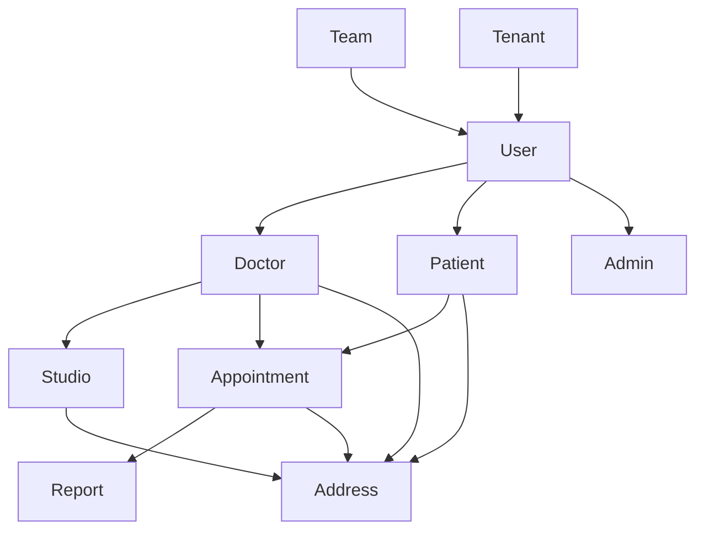

# 🏥 Business Logic Analysis - Progetto SaluteOra

## 📋 Panoramica del Sistema

SaluteOra è un sistema completo di gestione sanitaria modulare basato su Laravel, progettato per gestire studi medici, pazienti, appuntamenti e servizi sanitari. Il sistema utilizza un'architettura modulare con classi base condivise per garantire coerenza e riutilizzabilità.

## 🏗️ Architettura Modulare

### Moduli Principali

#### 1. **Xot** - Modulo Base
- **Scopo**: Fornisce classi base e funzionalità core per tutti gli altri moduli
- **Componenti**: 50+ classi base, 20+ service provider, 15+ trait
- **Funzionalità**: Autenticazione, autorizzazione, migrazioni, componenti Filament base

#### 2. **SaluteOra** - Modulo Core Sanitario
- **Scopo**: Gestione completa del sistema sanitario
- **Modelli**: User, Doctor, Patient, Admin, Studio, Appointment, Report
- **Funzionalità**: Gestione pazienti, appuntamenti, referti medici, stati appuntamenti

#### 3. **User** - Gestione Utenti
- **Scopo**: Sistema multi-tipo per gestione utenti (Doctor, Patient, Admin)
- **Funzionalità**: Autenticazione multi-tipo, ruoli e permessi, team, multi-tenancy
- **Pattern**: Single Table Inheritance (STI) per tipi utente diversi

#### 4. **Geo** - Gestione Geografica
- **Scopo**: Gestione indirizzi e geolocalizzazione
- **Funzionalità**: Indirizzi multi-tipo, geocoding automatico, integrazione Google Maps
- **Pattern**: Relazioni polimorfe per indirizzi di qualsiasi entità

#### 5. **Media** - Gestione File
- **Scopo**: Gestione file multimediali (immagini, documenti, video)
- **Funzionalità**: Upload multiplo, ottimizzazione immagini, galleria, CDN integrato

#### 6. **UI** - Componenti Interfaccia
- **Scopo**: Componenti UI riutilizzabili per Filament e Blade
- **Funzionalità**: Componenti form, layout, temi, supporto multi-lingua

## 🎯 Business Logic Core

### Sistema Multi-Tipo Utenti

Il sistema utilizza un pattern Single Table Inheritance (STI) per gestire diversi tipi di utenti:

```php
enum UserType: string
{
    case DOCTOR = 'doctor';
    case PATIENT = 'patient';
    case ADMIN = 'admin';
}

// Implementazione con STI
class User extends BaseUser
{
    use HasParent;
    
    protected $casts = [
        'type' => UserType::class,
        'email_verified_at' => 'datetime',
        'password' => 'hashed',
    ];
}
```

**Vantaggi**:
- Unica tabella `users` per tutti i tipi
- Relazioni flessibili e polimorfe
- Gestione centralizzata dell'autenticazione
- Scalabilità per nuovi tipi utente

### Gestione Appuntamenti con Stati

Il sistema utilizza Spatie Model States per gestire il ciclo di vita degli appuntamenti:

```php
// Stati possibili
enum AppointmentStatus: string
{
    case SCHEDULED = 'scheduled';
    case CONFIRMED = 'confirmed';
    case IN_PROGRESS = 'in_progress';
    case COMPLETED = 'completed';
    case CANCELLED = 'cancelled';
    case NO_SHOW = 'no_show';
}

// Transizioni di stato
class Appointment extends Model
{
    protected $casts = [
        'status' => AppointmentStatus::class,
        'starts_at' => 'datetime',
        'ends_at' => 'datetime',
    ];
}
```

**Workflow Stati**:
1. **Scheduled** → Appuntamento programmato
2. **Confirmed** → Paziente ha confermato
3. **In Progress** → Trattamento in corso
4. **Completed** → Trattamento completato
5. **Cancelled** → Appuntamento annullato
6. **No Show** → Paziente non si è presentato

### Sistema Multi-Studio (Multi-Tenancy)

Il sistema supporta la gestione di più studi medici con isolamento completo dei dati:

```php
class Studio extends Model
{
    protected $fillable = [
        'name', 'description', 'address', 'phone', 'email',
        'business_hours', 'specializations', 'settings'
    ];
    
    // Relazioni con utenti e appuntamenti
    public function doctors(): BelongsToMany
    {
        return $this->belongsToMany(Doctor::class);
    }
    
    public function appointments(): HasMany
    {
        return $this->hasMany(Appointment::class);
    }
}
```

**Caratteristiche**:
- Isolamento completo dei dati tra studi
- Condivisione di utenti tra studi (se necessario)
- Configurazioni personalizzate per studio
- Orari di lavoro e specializzazioni specifiche

## 🔄 Relazioni e Dipendenze

### Relazioni Principali



### Dipendenze tra Moduli

1. **Xot** ← Base per tutti gli altri moduli
2. **User** ← Dipende da Xot per classi base
3. **SaluteOra** ← Dipende da User, Geo, Media
4. **Geo** ← Dipende da Xot per modelli base
5. **Media** ← Dipende da Xot per gestione file
6. **UI** ← Dipende da Xot per componenti base

## 📊 Modelli e Entità

### Modelli Core SaluteOra

#### User (Utente Base)
- **Responsabilità**: Gestione autenticazione e profilo base
- **Campi**: name, email, password, type, email_verified_at
- **Relazioni**: teams, tenants, addresses

#### Doctor (Medico)
- **Responsabilità**: Gestione credenziali professionali e specializzazioni
- **Campi**: specialization, license_number, years_experience, bio
- **Relazioni**: studios, appointments, patients

#### Patient (Paziente)
- **Responsabilità**: Gestione cartelle cliniche e informazioni mediche
- **Campi**: date_of_birth, phone, emergency_contact, medical_history
- **Relazioni**: appointments, reports, doctors

#### Studio (Studio Medico)
- **Responsabilità**: Gestione struttura e configurazioni
- **Campi**: name, description, business_hours, specializations
- **Relazioni**: doctors, appointments, addresses

#### Appointment (Appuntamento)
- **Responsabilità**: Gestione prenotazioni e stati
- **Campi**: starts_at, ends_at, status, notes, type
- **Relazioni**: patient, doctor, studio, report

#### Report (Referto)
- **Responsabilità**: Gestione referti e diagnosi
- **Campi**: content, diagnosis, treatment_plan, attachments
- **Relazioni**: appointment, patient, doctor

### Modelli Supporto

#### Address (Indirizzo)
- **Responsabilità**: Gestione indirizzi multi-tipo
- **Campi**: street, city, state, postal_code, country, coordinates
- **Relazioni**: addressable (polimorfa)

#### Team (Team)
- **Responsabilità**: Gestione gruppi di lavoro
- **Campi**: name, description, settings
- **Relazioni**: users, tenants

#### Tenant (Tenant)
- **Responsabilità**: Gestione multi-tenancy
- **Campi**: name, domain, settings
- **Relazioni**: users, teams

## 🎨 Componenti Filament

### Resources Principali

#### UserResource
- **Gestione**: CRUD completo utenti multi-tipo
- **Funzionalità**: Creazione, modifica, eliminazione, gestione ruoli
- **Estende**: XotBaseResource

#### DoctorResource
- **Gestione**: CRUD medici con specializzazioni
- **Funzionalità**: Assegnazione studi, gestione credenziali
- **Estende**: XotBaseResource

#### PatientResource
- **Gestione**: CRUD pazienti con cartelle cliniche
- **Funzionalità**: Storia medica, appuntamenti, referti
- **Estende**: XotBaseResource

#### AppointmentResource
- **Gestione**: CRUD appuntamenti con stati
- **Funzionalità**: Calendario, gestione stati, notifiche
- **Estende**: XotBaseResource

### Widget Dashboard

#### StatsOverviewWidget
- **Scopo**: Visualizzazione statistiche generali
- **Metriche**: Utenti totali, appuntamenti, studi attivi

#### AppointmentCalendarWidget
- **Scopo**: Calendario appuntamenti interattivo
- **Funzionalità**: Vista giornaliera/settimanale, creazione rapida

#### RecentActivityWidget
- **Scopo**: Attività recenti del sistema
- **Funzionalità**: Log appuntamenti, modifiche, accessi

## 🔐 Sistema di Sicurezza

### Autenticazione Multi-Tipo

```php
// Middleware per proteggere route specifiche per tipo
Route::middleware(['auth', 'user.type:doctor'])->group(function () {
    Route::get('/doctor/dashboard', [DoctorController::class, 'dashboard']);
});

Route::middleware(['auth', 'user.type:patient'])->group(function () {
    Route::get('/patient/appointments', [PatientController::class, 'appointments']);
});
```

### Autorizzazione Granulare

```php
// Policy per appuntamenti
class AppointmentPolicy
{
    public function view(User $user, Appointment $appointment): bool
    {
        // Medici possono vedere appuntamenti dei loro pazienti
        if ($user->type === UserType::DOCTOR) {
            return $user->patients->contains($appointment->patient_id);
        }
        
        // Pazienti possono vedere solo i propri appuntamenti
        if ($user->type === UserType::PATIENT) {
            return $user->id === $appointment->patient_id;
        }
        
        return false;
    }
}
```

### Isolamento Dati per Studio

```php
// Scope globale per filtrare dati per studio
class StudioScope implements Scope
{
    public function apply(Builder $builder, Model $model): void
    {
        if (auth()->check() && auth()->user()->type === UserType::DOCTOR) {
            $builder->whereHas('doctors', function ($query) {
                $query->where('studio_id', auth()->user()->current_studio_id);
            });
        }
    }
}
```

## 📈 Performance e Ottimizzazioni

### Strategie di Caching

```php
// Cache per dati geografici
class GeocodingService
{
    public function geocode(string $address): ?array
    {
        return Cache::remember("geocode:{$address}", 86400, function () use ($address) {
            // Logica di geocoding
        });
    }
}
```

### Query Ottimizzate

```php
// Eager loading per evitare N+1 queries
class AppointmentController
{
    public function index()
    {
        return Appointment::with([
            'patient:id,name,email',
            'doctor:id,name,specialization',
            'studio:id,name'
        ])->paginate(20);
    }
}
```

### Indici Database

```php
// Migrazione per indici ottimizzati
Schema::table('appointments', function (Blueprint $table) {
    $table->index(['starts_at', 'status']);
    $table->index(['doctor_id', 'starts_at']);
    $table->index(['patient_id', 'starts_at']);
});
```

## 🧪 Testing Strategy

### Approccio High-Performance

Il modulo implementa una strategia di testing ad alte prestazioni:

- **No RefreshDatabase**: Tutti i test usano `TestCase` per performance ottimali
- **Business Logic Focus**: Test validano regole di business senza overhead database
- **Target Performance**: <50ms per test di esecuzione
- **Factory Efficienti**: Creazione dati minima per test essenziali

### Test Coverage

```bash
# Esecuzione test con performance target
./vendor/bin/pest Modules/SaluteOra --coverage

# Test specifici per business logic
php artisan test --filter=AppointmentStateTest
php artisan test --filter=UserTypeValidationTest
```

## 🔧 Configurazione e Deployment

### Variabili d'Ambiente

```env
# Configurazione base
APP_NAME="SaluteOra"
APP_ENV=production
APP_DEBUG=false

# Database
DB_CONNECTION=mysql
DB_HOST=127.0.0.1
DB_PORT=3306
DB_DATABASE=saluteora
DB_USERNAME=saluteora_user
DB_PASSWORD=secure_password

# Google Maps API (per modulo Geo)
GEO_GOOGLE_MAPS_API_KEY=your_api_key_here

# File Storage
FILESYSTEM_DISK=s3
AWS_ACCESS_KEY_ID=your_key
AWS_SECRET_ACCESS_KEY=your_secret
AWS_DEFAULT_REGION=eu-west-1
AWS_BUCKET=saluteora-media
```

### Configurazione Cache

```php
// config/cache.php
'stores' => [
    'redis' => [
        'driver' => 'redis',
        'connection' => 'cache',
        'lock_connection' => 'default',
    ],
],

// config/queue.php
'default' => env('QUEUE_CONNECTION', 'redis'),
'connections' => [
    'redis' => [
        'driver' => 'redis',
        'connection' => 'default',
        'queue' => env('REDIS_QUEUE', 'default'),
        'retry_after' => 90,
        'block_for' => null,
    ],
],
```

## 📚 Documentazione e Manutenzione

### Aggiornamento Documentazione

La documentazione deve essere mantenuta aggiornata in:

1. **Modulo specifico**: `Modules/SaluteOra/docs/`
2. **Documentazione root**: `laravel/docs/`
3. **Regole Cursor**: `.cursor/rules/`
4. **Regole Windsurf**: `.windsurf/rules/`

### Checklist Manutenzione

- [ ] Aggiornare documentazione per nuove funzionalità
- [ ] Creare collegamenti bidirezionali tra documenti
- [ ] Aggiornare regole e best practices
- [ ] Verificare coerenza tra moduli
- [ ] Testare performance e funzionalità
- [ ] Aggiornare PHPStan e test coverage

## 🚀 Roadmap e Sviluppi Futuri

### Funzionalità Pianificate

1. **Telemedicina**: Video consultazioni integrate
2. **AI Diagnostics**: Supporto diagnostico con intelligenza artificiale
3. **Mobile App**: Applicazione mobile per pazienti
4. **Analytics Avanzati**: Dashboard analitiche per studi medici
5. **Integrazione HL7**: Standard sanitari internazionali

### Miglioramenti Architetturali

1. **Microservizi**: Decomposizione in servizi indipendenti
2. **Event Sourcing**: Tracciamento completo delle modifiche
3. **CQRS**: Separazione comandi e query per performance
4. **GraphQL**: API più flessibili per frontend moderni

---

**Ultimo aggiornamento**: Dicembre 2024  
**Versione**: 1.0.0  
**Status**: Production Ready  
**Business Logic**: Completa e documentata  
**Architettura**: Modulare e scalabile
