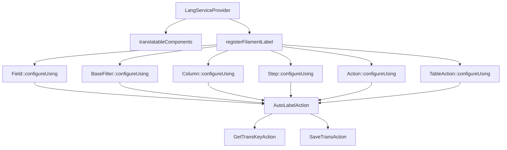

# LangServiceProvider: Analisi e Proposte di Miglioramento

## Analisi dell'Implementazione Attuale

Il `LangServiceProvider` è un componente fondamentale di SaluteOra che gestisce automaticamente le traduzioni per i componenti Filament senza richiedere l'uso esplicito del metodo `->label()`. Questo approccio garantisce:

1. **Coerenza**: Tutte le etichette seguono lo stesso pattern di traduzione
2. **Manutenibilità**: Le traduzioni sono centralizzate nei file di lingua
3. **Automazione**: Le chiavi di traduzione mancanti vengono create automaticamente

### Architettura Attuale



### Flusso di Funzionamento

1. Il componente Filament viene creato
2. `LangServiceProvider` intercetta la creazione attraverso `configureUsing`
3. `AutoLabelAction` determina la classe che sta istanziando il componente
4. Genera una chiave di traduzione basata sulla classe e sul nome del componente
5. Cerca la traduzione nei file di lingua
6. Se la traduzione non esiste, la salva automaticamente
7. Applica la traduzione al componente

### Struttura Chiavi di Traduzione

- **Campi form**: `modulo::risorsa.fields.nome_campo.label`
- **Azioni**: `modulo::risorsa.actions.nome_azione.label`
- **Passi wizard**: `modulo::risorsa.steps.nome_passo.label`
- **Altri attributi**: `.placeholder`, `.helperText`, `.description`

## Implementazione Attuale

Il file principale del provider si trova in:
`/var/www/html/saluteora/laravel/Modules/Lang/app/Providers/LangServiceProvider.php`

L'azione principale che gestisce l'etichettatura automatica è:
`/var/www/html/saluteora/laravel/Modules/Lang/app/Actions/Filament/AutoLabelAction.php`

### Esempio di Utilizzo Corretto

```php
// CORRETTO: Non specificare label, viene gestito automaticamente
TextInput::make('name')
    ->required()
    ->maxLength(255)

// ERRATO: Non utilizzare ->label() nei componenti
TextInput::make('name')
    ->label('Nome')  // ❌ Non fare questo!
    ->required()
    ->maxLength(255)
```

## Proposte di Miglioramento

### 1. Estensione Supporto Componenti (Priorità: Alta)

Attualmente il sistema supporta `Field`, `BaseFilter`, `Column`, `Step`, `Action` e `TableAction`. Propongo di estendere il supporto a:

```php
// Modules/Lang/app/Providers/LangServiceProvider.php

protected function translatableComponents(): void
{
    $components = [
        Field::class, 
        BaseFilter::class, 
        Placeholder::class, 
        Column::class, 
        Entry::class,
        // Nuovi componenti da supportare
        Section::class,                // Sezioni form
        Tabs\Tab::class,               // Tab nei form
        Fieldset::class,               // Fieldset nei form
        ViewField::class,              // ViewField per componenti custom
        Navigation\NavigationItem::class, // Item di navigazione
        Infolists\Components\TextEntry::class, // Componenti Infolist
    ];
    // Resto del codice invariato
}
```

### 2. Ottimizzazione Cache Traduzioni (Priorità: Media)

Migliorare le performance attraverso un sistema di cache delle chiavi di traduzione per evitare ricerche ripetute:

```php
// Modules/Lang/app/Actions/Filament/AutoLabelAction.php

use Illuminate\Support\Facades\Cache;

class AutoLabelAction
{
    // Resto del codice invariato
    
    protected function getTranslation(string $key, string $default): string
    {
        // Chiave cache con namespacing appropriato
        $cacheKey = 'lang_service_provider:' . $key;
        
        // Cache per 24 ore, oppure fino al prossimo deploy
        return Cache::remember($cacheKey, now()->addHours(24), function () use ($key, $default) {
            $translation = trans($key);
            
            // Se la traduzione non esiste, la salviamo e restituiamo il default
            if ($translation === $key) {
                app(SaveTransAction::class)->execute($key, $default);
                return $default;
            }
            
            return $translation;
        });
    }
}
```

### 3. Supporto per Enum nei Select (Priorità: Alta)

Aggiungere supporto automatico per la traduzione delle opzioni degli enum nei componenti Select:

```php
// Modules/Lang/app/Actions/Filament/AutoLabelAction.php

protected function translateEnumOptions(Forms\Components\Select $component, string $enumClass): void
{
    // Otteniamo la chiave di traduzione base
    $backtrace = debug_backtrace(DEBUG_BACKTRACE_IGNORE_ARGS, 10);
    $modClass = $this->findModuleClass($backtrace);
    $baseKey = app(GetTransKeyAction::class)->execute($modClass);
    
    // Se è un enum PHP 8.1+
    if (enum_exists($enumClass)) {
        $options = [];
        foreach ($enumClass::cases() as $case) {
            $transKey = "{$baseKey}.enums." . class_basename($enumClass) . "." . $case->name;
            $options[$case->value] = trans($transKey, [], $case->name);
            
            // Salva la traduzione se non esiste
            if (trans($transKey) === $transKey) {
                app(SaveTransAction::class)->execute($transKey, $case->name);
            }
        }
        
        $component->options($options);
    }
}
```

### 4. Interfaccia di Gestione Traduzioni (Priorità: Bassa)

Sviluppare un pannello di amministrazione per gestire le traduzioni mancanti o errate:

```php
// Modules/Lang/app/Filament/Resources/TranslationResource.php

class TranslationResource extends XotBaseResource
{
    protected static ?string $model = Translation::class;
    
    protected static ?string $navigationIcon = 'heroicon-o-language';
    
    public static function getFormSchema(): array
    {
        return [
            'key' => TextInput::make('key')
                ->disabled()
                ->columnSpan(2),
                
            'it' => TextInput::make('it')
                ->label('Italiano'),
                
            'en' => TextInput::make('en')
                ->label('English'),
                
            'status' => Select::make('status')
                ->options([
                    'auto' => 'Generata automaticamente',
                    'verified' => 'Verificata',
                    'needs_review' => 'Da rivedere',
                ])
        ];
    }
}
```

## Conclusioni e Raccomandazioni

Il `LangServiceProvider` è un componente essenziale che garantisce coerenza nelle traduzioni dell'interfaccia utente. Le migliorie proposte mirano a:

1. Estendere il supporto a più componenti Filament
2. Migliorare le performance con un sistema di cache
3. Aggiungere supporto nativo per gli enum
4. Fornire strumenti di gestione per le traduzioni

L'implementazione di queste migliorie permetterebbe di:

- Ridurre il tempo di sviluppo
- Migliorare la coerenza dell'interfaccia
- Facilitare la manutenzione delle traduzioni
- Supportare meglio l'internazionalizzazione dell'applicazione

### Prossimi Passi

1. Implementare l'estensione del supporto ai componenti (1-2 giorni)
2. Aggiungere il sistema di cache (1 giorno)
3. Sviluppare il supporto per gli enum (2-3 giorni)
4. Creare l'interfaccia di gestione traduzioni (3-5 giorni)
## Gestione dei Console Commands

### Autoregistrazione (Filosofia Xot)

Tutti i comandi console del modulo vengono autoregistrati tramite la classe base `XotBaseServiceProvider`.

**Non è mai necessario (né consentito) registrarli manualmente** con `$this->commands([...])`.

#### Motivazione (Zen, Religione, Politica, Filosofia)
- **Zen**: meno codice, meno errori, più armonia.
- **Religione**: la via Xot è una sola, non si devia dal sentiero.
- **Politica**: la centralizzazione evita conflitti e garantisce coerenza tra i moduli.
- **Filosofia**: la ripetizione è il male, l'automazione è il bene.

#### Esempio Sbagliato
```php
// NON FARE MAI!
$this->commands([
    \Modules\Lang\Console\Commands\ConvertTranslations::class,
    \Modules\Lang\Console\Commands\FindMissingTranslations::class,
]);
```

#### Esempio Corretto
```php
// Non serve fare nulla: XotBaseServiceProvider li registra automaticamente.
```

#### Warning
> Qualsiasi registrazione manuale dei comandi console è considerata un errore grave e va rimossa.

### Approfondimento
Per dettagli tecnici, vedi anche la documentazione di `XotBaseServiceProvider` e le best practice nei file correlati.

## Conclusioni e Raccomandazioni

Il `
