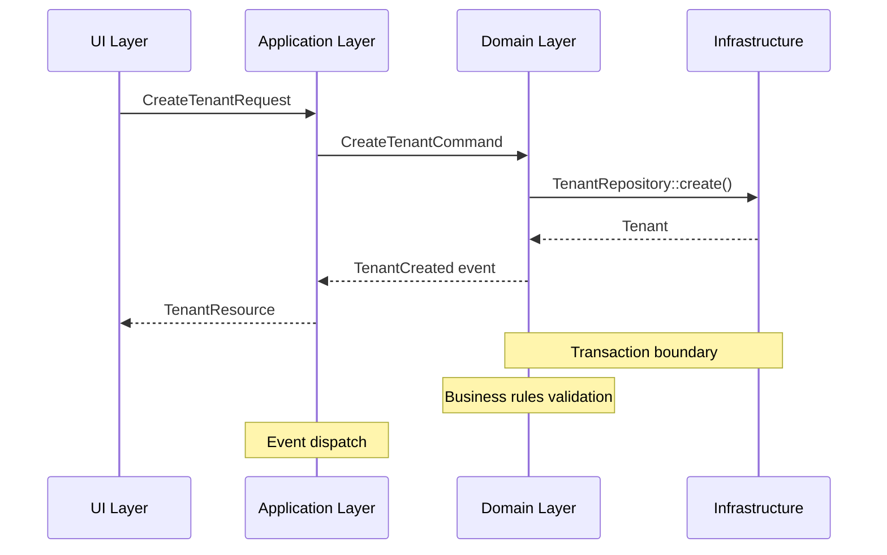

# Modular Monolith Architecture for Tenant Module

## Overview

This document outlines the architectural guidelines for implementing a modular monolith pattern in the Tenant module, following the principles outlined in the [Architecting Laravel the Right Way](https://medium.com/@mohamadshahkhajeh/architecting-laravel-the-right-way-modular-monoliths-done-right-ef-b8-8f-62d30a8b0efd) article while adhering to our project's standards and conventions.

## Core Principles

1. **Module Autonomy**
   - Each module is a self-contained unit with its own:
     - Domain logic
     - Application services
     - Infrastructure code
     - UI components

2. **Strict Boundaries**
   - Modules communicate through well-defined interfaces
   - No direct dependencies between modules' internals
   - Shared kernel for cross-cutting concerns only

3. **Hexagonal Architecture**
   - Domain layer at the core
   - Application services orchestrating use cases
   - Infrastructure adapters for external concerns

## Directory Structure

```
Tenant/
├── Modules/                    # Feature modules
│   ├── Organization/          # Example module
│   │   ├── Application/       # Use cases and DTOs
│   │   ├── Domain/            # Business logic and entities
│   │   ├── Infrastructure/    # Database, external services
│   │   └── UI/                # Web interfaces, API endpoints
│   └── ...
├── Shared/                    # Shared kernel
│   ├── Domain/                # Shared domain concepts
│   └── Kernel/                # Cross-cutting concerns
└── Providers/                 # Module service providers
```

## Implementation Guidelines

### 1. Module Structure

Each module should follow this internal structure:

```
ModuleName/
├── Application/
│   ├── Commands/             # Application services
│   ├── DTOs/                 # Data Transfer Objects
│   └── Events/               # Application events
├── Domain/
│   ├── Models/              # Eloquent models
│   ├── Entities/             # Domain entities
│   ├── Repositories/         # Interface definitions
│   └── Services/             # Domain services
├── Infrastructure/
│   ├── Repositories/        # Repository implementations
│   ├── Services/             # External service integrations
│   └── Listeners/            # Event listeners
└── UI/
    ├── Http/
    │   ├── Controllers/      # Web controllers
    │   └── Requests/        # Form requests
    └── Resources/           # API resources
```

### 2. Communication Between Modules

Use one of these patterns for inter-module communication:

1. **Events** (preferred for decoupling)
   ```php
   // In source module
   event(new TenantCreated($tenant));
   
   // In consuming module
   class UpdateBillingOnTenantCreated
   {
       public function handle(TenantCreated $event)
       {
           // Handle the event
       }
   }
   ```

2. **Service Layer** (when direct access is needed)
   ```php
   // In service provider
   $this->app->bind(TenantBillingServiceInterface::class, TenantBillingService::class);
   
   // In consuming class
   public function __construct(
       private TenantBillingServiceInterface $billingService
   ) {}
   ```

### 3. Shared Kernel

Keep the shared kernel minimal. It should only contain:

- Common value objects
- Shared utilities
- Cross-cutting concerns (logging, exceptions, etc.)

### 4. Testing Strategy

1. **Unit Tests**
   - Test domain logic in isolation
   - Mock external dependencies
   - Focus on business rules

2. **Feature Tests**
   - Test module boundaries
   - Verify module interactions
   - Use in-memory database when possible

3. **Integration Tests**
   - Test module integration points
   - Verify database interactions
   - Test event handling

## Migration Strategy

1. **Start Small**
   - Begin with a single, well-defined module
   - Refactor incrementally
   - Maintain backward compatibility

2. **Extract Gradually**
   - Identify bounded contexts
   - Move related code together
   - Update dependencies

3. **Document Changes**
   - Update module boundaries
   - Document module responsibilities
   - Maintain dependency graphs

## Best Practices

1. **Dependency Rule**
   - Dependencies should point inward (UI → Application → Domain)
   - Domain layer should have no dependencies on other layers

2. **Module Registration**
   ```php
   // In ModuleServiceProvider
   public function register()
   {
       $this->app->register(ModuleServiceProvider::class);
   }
   ```

3. **Configuration**
   - Each module can have its own config file
   - Use `Config::get()` with module prefix
   - Document all config options

## Example: Tenant Creation Flow



## Related Documentation

- [Module Structure](structure.md)
- [Event System](../Xot/docs/event_system.md)
- [Testing Strategy](../testing/README.md)
- [API Documentation](../api.md)

## References

- [Architecting Laravel the Right Way](https://medium.com/@mohamadshahkhajeh/architecting-laravel-the-right-way-modular-monoliths-done-right-ef-b8-8f-62d30a8b0efd)
- [Domain-Driven Design](https://domainlanguage.com/ddd/)
- [Laravel Modules Documentation](https://nwidart.com/laravel-modules/v6/introduction)
