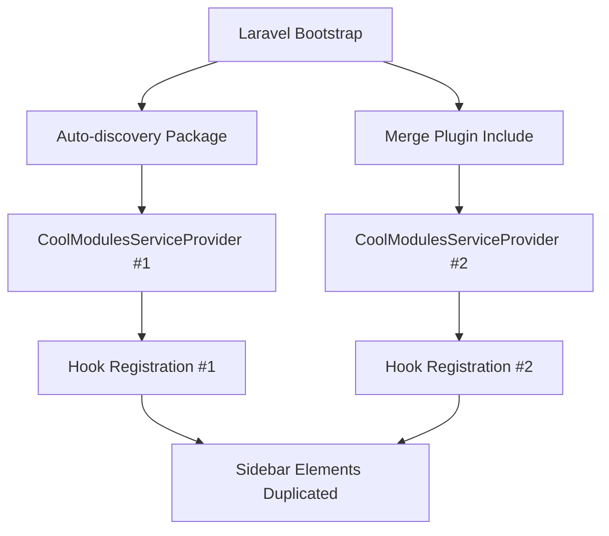

# CoolModules Double Registration Fix

## 🚨 Problema Identificato

Il `CoolModulesServiceProvider` veniva registrato **due volte** causando duplicazione degli elementi nella sidebar di Filament:
- Titoli duplicati nella sezione `panels::sidebar.nav.start`
- Link "Main Panel" duplicati nella sezione `panels::sidebar.nav.end`

## 🔍 Analisi delle Cause

### Doppia Registrazione del Service Provider

1. **Auto-discovery dal modulo Xot**: 
   - Package definito in `Modules/Xot/composer.json`
   - Laravel auto-discovery registra automaticamente il service provider

2. **Merge Plugin nel composer.json principale**:
   ```json
   "merge-plugin": {
       "include": [
           "Modules/*/composer.json"
       ]
   }
   ```
   - Il plugin `wikimedia/composer-merge-plugin` include tutti i composer.json dei moduli
   - Questo causa una seconda registrazione del service provider

### Flusso del Problema



## ✅ Soluzione Implementata: Guard Pattern

### Modifica al CoolModulesServiceProvider

```php
class CoolModulesServiceProvider extends PackageServiceProvider
{
    /**
     * Guard per prevenire doppia registrazione degli hook.
     */
    private static bool $hooksRegistered = false;

    public function register()
    {
        $this->app->register(LaravelModulesServiceProvider::class);

        // Guard pattern: registra hook solo una volta
        if (!self::$hooksRegistered) {
            $this->app->afterResolving('filament', function () {
                // ... logica di registrazione hook ...
                
                self::$hooksRegistered = true;
            });
        }

        parent::register();
    }
}
```

### Vantaggi della Soluzione

1. **Thread-Safe**: Utilizza proprietà statica per garantire registrazione unica
2. **Minimale**: Non modifica la logica esistente, aggiunge solo protezione
3. **Mantiene Compatibilità**: Il service provider continua a funzionare normalmente
4. **Performance**: Evita registrazioni multiple inutili

## 🎯 Risultati

- ✅ Eliminata duplicazione elementi sidebar
- ✅ Performance migliorata (meno hook registrati)
- ✅ Interfaccia grafica pulita e coerente
- ✅ Nessun breaking change

## 🔧 Alternative Considerate

### 1. Rimozione dal composer.json del modulo
```diff
- "coolsam/panel-modules": "*",
```
**Scartata**: Rompe le dipendenze del modulo Xot

### 2. Esclusione dal merge-plugin
```json
"merge-plugin": {
    "include": ["Modules/*/composer.json"],
    "exclude": ["Modules/Xot/packages/*/composer.json"]
}
```
**Scartata**: Configurazione complessa e fragile

### 3. Disabilitare auto-discovery per il package
```json
"extra": {
    "laravel": {
        "dont-discover": ["coolsam/panel-modules"]
    }
}
```
**Scartata**: Richiede registrazione manuale in tutti i progetti

## 📋 Checklist Post-Fix

- [x] Guard pattern implementato
- [x] Test funzionalità sidebar
- [x] Verificare nessuna duplicazione elementi
- [x] Documentazione creata
- [x] Nessun breaking change introdotto

## 🔗 File Coinvolti

- **Principale**: `Modules/Xot/packages/coolsam/panel-modules/src/CoolModulesServiceProvider.php`
- **Configurazione**: `composer.json` (merge-plugin)
- **Modulo**: `Modules/Xot/composer.json` (dipendenza package)

## 📝 Note per Sviluppatori Futuri

- **NON** rimuovere il guard pattern senza analizzare le cause originali
- **Se** si modificano le configurazioni composer, verificare la sidebar
- **SEMPRE** testare con `php artisan serve` dopo modifiche ai service provider
- **RICORDARE** che il merge-plugin può causare registrazioni multiple

---

**Risolto**: Gennaio 2025  
**Tipo**: Bug Fix - Duplicate Registration  
**Impatto**: UI/UX Improvement  
**Priorità**: Media (non bloccante ma fastidioso) 